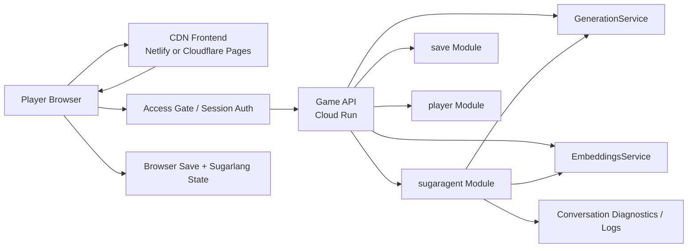

# Web Release Target Publish System Design

## Status

Proposed

## Purpose

This document defines the high-level production architecture for publishing a game with SugarEngine with a web target:

- static frontend delivery through a CDN,
- a backend on Cloud Run,
- Sugarlang and SugarAgent both active in production,
- no new plugin-to-plugin coupling,
- browser-first game state ownership,
- room for future browser-local and native deployment variants,
- preservation of Tauri-based native packaging paths for desktop and mobile targets.

## Executive Summary

The web target should publish as a web stack:

1. SugarEngine prepares and scaffolds release inputs into a game repository,
2. the game repository deploys a static web client to a CDN,
3. the game repository deploys a game-specific web API modular monolith to Google Cloud Run.

The CDN serves the game shell, exported game data, assets, and static plugin content.

The Cloud Run service owns game backend concerns, including:

- a `sugaragent` backend module as the plugin-facing orchestration layer,
- shared `GenerationService` and `EmbeddingsService` contracts that can be reused later by other backend modules if needed.

The browser remains authoritative for:

- active save state,
- quest state,
- region/scene progression,
- Sugarlang learner state,
- conversation UI state,
- engine/plugin orchestration.

The shared inference layer remains authoritative only for:

- turn generation,
- embeddings,
- AI-runtime-only transient caches,
- inference diagnostics.

SugarEngine remains the scaffolding and export authority.
Each game repository remains the release and deployment authority for that game.

This keeps the engine/plugin boundaries clean while making the current Node/native SugarAgent stack publishable on the web without requiring a broad browser-runtime rewrite as a first production step.

Because this architecture introduces a publicly reachable backend with hosted inference endpoints, access control and abuse prevention are part of the system design from the start.

## Why This Architecture

### Current Static Publish Already Exists

The static publish path is already documented in [deployment.md](/Users/nikki/projects/sugarengine/docs/dev/deployment.md#L129) and ends in a Netlify deploy step in [deployment.md](/Users/nikki/projects/sugarengine/docs/dev/deployment.md#L143).

That means the game shell, exported data, and staged assets already have a credible CDN-friendly story.

### Current SugarAgent Runtime Is Not Browser-Publishable As-Is

Today the browser-facing runtime bridge proxies to a local dev endpoint in [HttpLocalRuntimeBridge.ts](/Users/nikki/projects/sugarengine/src/plugins/sugaragent/runtime/HttpLocalRuntimeBridge.ts#L38).

That dev endpoint ultimately runs a Node-side runtime that:

- shells out to `llama-completion`,
- reads local model files from disk,
- uses `onnxruntime-node` for embeddings,
- assumes local filesystem and child-process access.

See:

- [runtime.ts](/Users/nikki/projects/sugarengine/src/plugins/sugaragent/session/runtime.ts#L2441)
- [local-embedding-runtime.ts](/Users/nikki/projects/sugarengine/src/plugins/sugaragent/runtime/local-embedding-runtime.ts#L12)

That stack fits a hosted container much more directly than it fits a static browser deploy.

### Cloud Run Is the Best Current Fit

Cloud Run gives us:

- standard container deployment,
- managed HTTPS,
- autoscaling,
- minimum instances to keep inference warm,
- optional GPU support later if needed,
- much less operational overhead than ECS-on-EC2 or Kubernetes.

This makes it the best balance of:

- shipping speed,
- operational simplicity,
- compatibility with the current runtime architecture.

## Goals

- Publish a game as a web experience with a CDN-hosted frontend.
- Preserve current SugarAgent and Sugarlang behavior.
- Avoid introducing plugin-to-plugin dependencies.
- Keep SugarEngine functional without either plugin.
- Keep SugarAgent functional without Sugarlang.
- Keep Sugarlang functional without SugarAgent.
- Make the production runtime observable and debuggable.
- Minimize latency added by remote inference through warm instances and a narrow runtime surface.
- Prevent unauthenticated public use of hosted SugarAgent-backed endpoints.
- Establish an access-control posture that works for a closed alpha and can grow into real account-based auth later.
- Preserve the ability to ship a SugarEngine game as a Tauri-packaged native application in addition to the hosted web deployment.

## Non-Goals

- Browser-local inference in the first production web release.
- A vendor-neutral multi-cloud backend in v1.
- Full multi-region active-active inference in v1.
- Replacing the current SugarAgent runtime with a totally different inference stack in the first release.
- Making the `sugaragent` backend module authoritative for save/load or game progression.
- Solving mobile-class browser inference in this document.
- Designing the full long-term identity platform in this document.
- Making the SugarEngine repository the production release source of truth for deployed games.

## Architectural Principles

### 1. SugarEngine Scaffolds, Game Repositories Release

SugarEngine owns:

- engine/editor/tooling behavior,
- export formats,
- shared release-target contracts,
- scaffolding for newly created game repositories.

Each game repository owns:

- release-target configuration,
- environment wiring,
- CI/CD workflows,
- deployment history for that specific game.

The `Publish` action in SugarEngine may prepare or update release inputs, but production deployment remains game-repository-driven.

### 2. Engine Contracts Stay Engine-Owned

The browser app continues to talk in engine-owned and plugin-contract-owned request shapes.

The engine does not become Cloud Run aware.

The engine chooses providers and passes generic context, including pedagogy context, exactly as it does now.

### 3. Sugarlang Supplies Pedagogy, Not Hosting

Sugarlang continues to produce:

- target language,
- support language,
- learner band,
- delivery contract,
- learner-policy guidance.

Sugarlang does not gain any dependency on Cloud Run, container hosting, or SugarAgent internals.

### 4. SugarAgent Owns Inference Behavior

SugarAgent continues to own:

- interpretation,
- retrieval,
- planning,
- generation,
- audit,
- repair,
- hosted `sugaragent` module diagnostics.

Only the deployment topology changes.

The backend implementation of those responsibilities does not require `sugaragent` to own the low-level inference primitives forever.

The recommended layering is:

- `sugaragent` as the plugin-facing orchestration module,
- `GenerationService` as a shared backend service contract,
- `EmbeddingsService` as a shared backend service contract.

The interpret → retrieve → plan → generate → audit → repair pipeline should live in a shared session runtime core rather than being reimplemented separately for preview and hosted play.

### 5. Browser Owns Player State

The browser remains authoritative for:

- active save state,
- quest progress,
- active episode/region,
- learner state,
- conversation history kept in game state/plugin state.

The `sugaragent` backend module may cache transient session data for performance, but it must not become the source of truth for persistent gameplay state.

### 6. `sugaragent` Is a Backend Subsystem, Not a New Game Authority

The hosted `sugaragent` backend module is an implementation detail of SugarAgent deployment inside the game API.

It is not a second game server.

It is also not the future persistence backend for saves, accounts, or cross-device progression.

### 7. Hosted SugarAgent Requires Explicit Access Control

The architecture must assume that reachable hosted SugarAgent endpoints will attract:

- direct endpoint probing,
- accidental public sharing,
- replay abuse,
- cost amplification through bots or overuse.

That means access control is not optional hardening.

It is part of the production design.

The site gate and the `sugaragent` endpoint gate are related, but they are not the same boundary.

### 8. One Service, Clear Internal Domains

The recommended deployment unit is one `game-api` service per game environment.

Inside that service, concerns should stay modular:

- `auth`
- `player`
- `save`
- `sugaragent`
- `generation`
- `embeddings`

This is a modular monolith, not a grab-bag.

It reduces operational complexity while keeping code boundaries clear enough to split later if real scaling or ownership pressure appears.

### 9. Generic Role Names, Slugged Deployment Names

Architecture documents should use generic role names such as:

- `game API`
- `CDN frontend`
- `sugaragent` backend module

Deployment resources should use game-specific slugged names.

The default naming rule should be:

- service base name: `<game-slug>-api`
- environment-qualified name: `<game-slug>-api-<environment>` when needed

This keeps the design reusable across games while making deployed resources unambiguous in cloud consoles, logs, and CI/CD output.

## Proposed Topology



## Major Components

### 1. CDN Frontend

Responsibilities:

- serve the web app,
- serve exported game data,
- serve staged game assets,
- serve static Sugarlang content artifacts,
- bootstrap the game client,
- call the runtime API over HTTPS.

Initial recommendation:

- keep the current CDN story on Netlify unless another CDN is chosen for product reasons unrelated to runtime hosting.

### 2. Browser Game Client

Responsibilities:

- run SugarEngine,
- load project/game content,
- host UI and scene logic,
- own player save state,
- own plugin state persistence,
- collect runtime request context,
- call the game API through a browser-safe runtime bridge.

The browser may hold a session credential for authenticated API calls, but credential issuance and verification belong to the access-control boundary, not to game-state logic.

The plugin-facing runtime bridge contract should stay deployment-topology-agnostic.

That means:

- SugarAgent continues to call one bridge abstraction,
- local preview uses a local/dev bridge implementation,
- hosted web uses a production HTTP bridge implementation,
- bridge selection happens at composition/bootstrap time, not inside SugarAgent logic.

The current flat local dev envelope such as `{ op: 'generateStructured' }` is a local transport detail, not the long-term public API contract.

### Shared Session Runtime Core

The backend architecture should not duplicate the SugarAgent session runtime in two divergent codepaths.

The intended shape is:

- a shared, deployment-agnostic session runtime core owned from the SugarEngine side,
- a local preview wrapper that uses that core in preview/dev,
- a hosted backend wrapper that uses that same core in `game-api`.

The game repository should consume that shared core through a versioned dependency boundary.

It should not:

- import the entire SugarEngine editor application as a runtime dependency,
- vendor/copy the session runtime source during scaffolding,
- fork the orchestration logic into a second independently evolving implementation.

### 3. Game API

Responsibilities:

- expose a stable HTTP interface for game backend capabilities,
- require authenticated access for protected endpoints,
- host the `auth`, `player`, `sugaragent`, and optional `save` backend modules,
- host shared `GenerationService` and `EmbeddingsService` implementations,
- return structured diagnostics,
- stay stateless or only transiently stateful from a gameplay-authority perspective.

Recommended initial API surface:

- `GET /health`
- `POST /auth/login`
- `POST /sugaragent/generateStructured`
- `POST /sugaragent/embed`
- `GET /player/me`

Conditional endpoints when hosted persistence is enabled for a game:

- `GET /save`
- `PUT /save`

Optional later operator/internal endpoints:

- `POST /ops/models/load`
- `POST /ops/models/unload`
- `GET /metrics`

These are not part of the normal browser-play API surface.

For the hosted browser path, model lifecycle remains backend-owned.

That means:

- the browser should not directly command model load/unload in v1,
- the production runtime bridge may still expose `loadModel` / `unloadModel` methods for cross-environment parity,
- but the hosted browser implementation may satisfy those methods as no-op or readiness-check semantics rather than public player-facing HTTP calls.

For v1, `GET /player/me` should be treated as a session-bootstrap and session-introspection endpoint.

Because the preferred browser auth path uses a secure `HttpOnly` cookie, browser code cannot inspect token claims directly.

Therefore `GET /player/me` remains useful even before real account-backed identity exists.

In the first hosted release, it may return:

- a session-derived anonymous player identifier,
- authenticated/not-authenticated state,
- game/environment identifiers,
- enabled feature flags such as whether hosted save persistence is available.

It does not require a durable account/profile database in v1.

### 4. Access Gate / Session Auth

Responsibilities:

- restrict play access during closed alpha and early hosted rollout,
- authenticate a player before protected play begins,
- issue a short-lived session credential for browser-to-API calls,
- give protected game API modules a verifiable trust signal,
- support later migration to account-based auth without changing engine/plugin contracts.

Recommended v1 posture:

- site-level front-door protection,
- separate server-verified login for protected play,
- short-lived signed session token or secure cookie presented on protected API requests.

This keeps the architecture safe enough for a shared-password alpha without pretending that site gating alone secures the backend.

### 5. `sugaragent` Backend Module

Responsibilities:

- host the plugin-facing SugarAgent orchestration logic,
- translate runtime results into the existing structured turn contract.

This module should depend on shared inference capabilities rather than permanently owning them.

### 6. Shared `GenerationService`

Responsibilities:

- execute the model-backed structured generation path,
- encapsulate low-level generation engine details,
- remain reusable by future backend modules if needed.

For v1, this service may still wrap the current `llama.cpp`-based generation path.

Concretely, this should exist in backend code as an internal service interface plus one selected adapter implementation.

The intended shape is:

- `sugaragent` depends on a stable `GenerationService` interface,
- application/bootstrap wiring selects the concrete implementation,
- the concrete implementation may call local binaries/libraries in v1,
- a future implementation may call a self-hosted or commercial server boundary without changing `sugaragent` orchestration code.

### 7. Shared `EmbeddingsService`

Responsibilities:

- execute vector/embedding inference,
- encapsulate low-level embedding runtime details,
- remain reusable by future backend modules if needed.

For v1, this service may still wrap the current ONNX embedding path.

Concretely, this should also exist as an internal service interface plus one selected adapter implementation.

The intended shape is:

- `sugaragent` depends on a stable `EmbeddingsService` interface,
- bootstrap wiring selects the concrete implementation,
- the concrete implementation may use ONNX locally in v1,
- a future implementation may call another local runtime or a remote embedding service without changing orchestration code.

These are backend-internal services.

They are not:

- public API route families,
- plugin-facing bridge contracts,
- code copied into each consuming module.

### 8. Model/Artifact Packaging

For the first release, the simplest and safest path is:

- package the required chat model,
- package the required embedding artifacts,
- ship them with the runtime image,
- keep a single deployment artifact with clear versioning.

This makes production parity easier to reason about.

A future ADR may move large model artifacts out of the image if image size or deploy velocity becomes unacceptable.

## Request Flow

### Conversation Turn

1. Browser UI sends a player turn into SugarEngine.
2. Engine routes through the normal provider stack.
3. SugarAgent plugin builds a runtime request using existing context contracts.
4. Browser bridge sends HTTPS request to the game API.
5. The `sugaragent` backend module orchestrates:
   - interpret,
   - retrieve,
   - plan,
   - generate,
   - audit,
   - repair.
   using shared `GenerationService` and `EmbeddingsService` implementations where needed.
6. The game API returns structured turn output plus diagnostics.
7. Browser applies deterministic progression and persistence rules locally.
8. UI renders the result.

### Sugarlang + SugarAgent Cooperation

1. Sugarlang computes learner-facing pedagogy context in-browser.
2. Engine passes generic pedagogy context through the normal conversation contract.
3. The `sugaragent` backend module consumes that context generically.
4. The game API returns target-language, band-shaped replies.

No Sugarlang-specific remote service is introduced.

## Deployment Modes

### Local Authoring / Preview

Keep the current local preview/dev behavior:

- Vite middleware runtime endpoint,
- local `llama.cpp`,
- local `onnxruntime-node`,
- rich preview diagnostics.

This keeps fast iteration and avoids coupling development workflow to cloud availability.

### Web Production

Switch the browser-facing bridge from local dev endpoint semantics to game API semantics.

This should be done by swapping bridge implementations, not by making SugarAgent own deployment-topology branching.

The intended shape is:

- one stable plugin-facing runtime bridge contract,
- `HttpLocalRuntimeBridge` for preview/dev,
- a production HTTP bridge implementation for the hosted game API,
- the hosted bridge translating the stable bridge methods into domain-routed API calls such as `/sugaragent/generateStructured` and `/sugaragent/embed`.

The production browser must not depend on:

- local Vite middleware,
- child processes,
- local filesystem access,
- node-only inference packages.

### Expected Frontend Delta for the Web Target

The frontend delta should stay intentionally small.

The web target should continue to be a Vite-built static frontend with the existing game bootstrap and asset-loading model.

The expected frontend changes are:

- inject deployment-specific runtime configuration such as API base URL and backend-required toggles,
- select the production runtime bridge implementation,
- perform auth/session bootstrap for protected play,
- send credentialed HTTPS requests to the game API,
- surface explicit degraded/unavailable backend states without crashing gameplay,
- propagate trace/request identifiers for observability where needed.

The web target should not require a wholesale frontend rewrite just to support the hosted backend.

In particular, it should not require rethinking:

- scene/bootstrap ownership,
- asset loading architecture,
- Sugarlang browser-side pedagogy computation,
- the overall game-shell build shape.

### Native/Desktop

Desktop/native remains a valid future or parallel deployment target.

This system design does not remove that path.

It simply defines the primary hosted web path.

In particular, nothing in this architecture should prevent:

- macOS desktop distribution via Tauri packaging,
- iOS/iPadOS native distribution via Tauri-supported mobile packaging,
- future native builds using local or hosted backend selection as a deployment-time decision.

The web backend work should therefore preserve two important freedoms:

1. the client can target a hosted game API when that is the selected deployment mode,
2. native builds can still use a Tauri-native path where local resources, bundled runtimes, or platform-specific distribution concerns justify it.

This means web deployment architecture must not become the only supported product architecture.

## Deployment Strategy Considerations

This architecture is only viable if deployment is heavily automated.

The system should not rely on a long sequence of manual steps spread across:

- editor export,
- static frontend deployment,
- backend deployment,
- environment wiring,
- auth configuration.

### Repository Responsibilities

The release architecture needs a clean repo boundary.

SugarEngine is responsible for:

- scaffolding a new game repository with release-target structure,
- generating canonical game export outputs,
- maintaining shared target contracts and build conventions.

Each game repository is responsible for:

- owning the published game content for that title,
- storing target-specific deployment profiles,
- owning CI/CD workflows,
- owning environment bindings and deployment history.

### SugarEngine Scaffolding Role

When a new game is created, SugarEngine should scaffold as much of the release shape as possible into the chosen game directory/repository, including:

- target profile templates,
- workflow templates,
- backend container/build templates,
- environment/config examples,
- release metadata stubs.

Later publish/update flows may refresh generated release inputs, but they should not move release authority out of the game repository.

### Scaffolded Game Repository Shape

The default scaffolded game repository should have a concrete release shape, not just a loose collection of files.

The preferred v1 structure is:

```text
<game-root>/
  project.sgrgame
  assets/
  plugins/
  config/
  manifests/
  exports/
  release/
    targets/
      web/
        profile.staging.json
        profile.production.json
        game-api/
          package.json
          tsconfig.json
          Dockerfile
          .dockerignore
          src/
            index.ts
            routes/
              auth.ts
              player.ts
              save.ts
              sugaragent.ts
            services/
              auth/
              player/
              save/
              sugaragent/
  .github/
    workflows/
      deploy-web-staging.yml
      deploy-web-production.yml
  package.json
```

### Backend Application Shape

The scaffolded backend should be:

- a standalone Node.js TypeScript application,
- housed inside the game repository,
- structured under `release/targets/web/game-api` for the web target,
- released from the game repository's CI/CD pipeline.

The recommended v1 server framework is Fastify.

Why Fastify:

- clean route/module structure,
- strong TypeScript ergonomics,
- good JSON API performance,
- straightforward schema validation and request lifecycle hooks,
- a better fit than ad hoc Express-style growth for a service that already needs typed request/response boundaries.

### Container and Workflow Files

The scaffolded game repository should include:

- a dedicated `Dockerfile` for `release/targets/web/game-api`,
- a `.dockerignore`,
- GitHub Actions workflows as the default CI/CD automation path,
- deployment profiles that declare environment-specific service name, region, hostnames, and feature toggles.

Those deployment profiles should live under the target they configure.

For the current web target, the preferred location is:

- `release/targets/web/profile.staging.json`
- `release/targets/web/profile.production.json`

The default scaffold should not generate both GitHub Actions and Cloud Build automation in v1.

One deployment control plane should be scaffolded by default.

Given the rest of this architecture, that default should be GitHub Actions.

### Dependency Boundary

The scaffolded backend must not vendor SugarEngine source code.

Instead, it should consume versioned SugarEngine-owned packages for:

- the shared SugarAgent session runtime core,
- shared request/response contract types,
- any other intentionally exported runtime packages needed by the backend.

That means the game repository should depend on SugarEngine through a versioned package boundary, not through copied source generated at scaffold time.

### What the Scaffold Must Not Do

The scaffold should not:

- copy the SugarEngine editor app into the game repo,
- vendor `session/runtime.ts`,
- generate a second independent SugarAgent runtime implementation,
- make the backend a hidden sub-mode of the editor instead of a real standalone service app.

### Recommended Responsibility Split

The clean split is:

- the editor `Publish` action remains an authoring/export/scaffolding concern,
- game-repository CI/CD remains the source of truth for production deployment and promotion.

That means the editor can still help with:

- export,
- asset staging,
- local validation,
- production-build preflight,
- updating the game repository working tree,
- eventually triggering an automated deploy action,

but the editor should not become the place where production infrastructure logic lives.

### Recommended Production Posture

- declarative per-game deployment configuration,
- one shared automation pipeline shape,
- automated frontend deploy,
- automated game API deploy,
- environment-specific secrets managed outside the editor,
- promotion triggered by a GitHub workflow, merge policy, or explicit release action.

### Per-Game Configuration

Make deployment behavior configurable per game.

Configuration stays declarative.

What should vary per game:

- site/domain target,
- frontend hosting target,
- backend service target,
- deployed service name,
- mount path/base path,
- environment names,
- feature flags,
- deploy toggles such as whether a backend is required.

These settings should live in the game repository as deployment profiles scaffolded initially by SugarEngine.

The default scaffolded backend service name should be derived from the game slug rather than a generic shared name.

What should not vary per game:

- the overall deployment machinery,
- the CI/CD control plane,
- the release/promotion model,
- the shape of observability and rollback.

In other words:

- per-game deployment profile: yes
- per-game custom deploy logic: no

### Source of Truth

The source of truth for release should be a repository-driven automation system such as GitHub Actions in the game repository.

The likely release actions are:

- merge/promotion to a protected branch,
- manual workflow dispatch from GitHub,
- eventually a one-click editor action that triggers the same workflow rather than bypassing it.

That preserves:

- auditability,
- rollback clarity,
- staging/production promotion discipline,
- secret handling outside the editor.

### UX Goal

The product goal should still be:

- as close to a button press as possible

but the implementation should be:

- a button or workflow that triggers automation,
- not a human remembering ten deployment steps.

That means a healthy end state is something like:

- editor publish/export,
- commit published game to game repository,
- CI/CD builds and deploys the frontend and game API together,
- deployment status and logs are visible in one place.

deployment must be automated, repo-driven, and configurable by game profile rather than by ad hoc manual procedure.

## Distribution Targets

This architecture should be understood as part of a broader target-based build and release model.

A published game should not accumulate separate ad hoc publish pipelines for:

- web,
- macOS desktop,
- iPhone/iPad,
- Android,
- future native or store-specific targets.

Instead, the system should treat these as distribution targets built from the same canonical game export.

### Recommended Model

- one canonical export/package representation of the game,
- one shared build/release control plane,
- multiple target adapters.

That means:

- `web` is one target,
- future Tauri-packaged Apple desktop distribution is another target,
- future iOS/iPadOS packaging is another target,
- future Android packaging is another target.

### Architectural Implication

The editor should not embed target-specific deployment logic.

The editor may initiate or prepare a publish/build action, but target-specific build and release behavior should live in:

- game-repository automation workflows,
- build scripts,
- release tooling,
- target configuration.

### Design Rule

The guiding rule should be:

- one canonical game export,
- many distribution targets,
- one automation-first release system.

This keeps the web architecture from becoming the accidental definition of all product delivery, while still allowing the web path to be the first hosted production target.

## Recommended Cloud Run Shape

### v1 `game-api` Service

One Cloud Run service per game environment:

- one public HTTPS endpoint,
- one container,
- one runtime process,
- backend modules for auth, player, save, and `sugaragent`,
- shared `GenerationService` and `EmbeddingsService` implementations available inside the same service.

Why:

- lowest code churn,
- lowest network hop count,
- easiest observability,
- easiest rollback story,
- easiest parity with current runtime.

In deployment configuration, this service should normally be named from the game slug, such as `<game-slug>-api`.

### Scaling Posture

For v1:

- use minimum instances to keep at least one warm instance,
- use instance-based billing if needed for predictable inference readiness,
- cap max instances conservatively,
- start in one region near the primary player base.

### CPU/GPU Posture

For v1:

- start from the current CPU-oriented runtime behavior unless latency data proves it unacceptable.

## State Ownership

### Browser-Owned Persistent State

Persistent and authoritative:

- save data,
- quest/objective state,
- inventory and world state,
- Sugarlang learner state,
- plugin memory serialized in client-owned save domain.

This is the v1 ownership model for active play.

Therefore, cloud-backed save persistence is not part of the minimum hosted-AI v1 release.

The first hosted release may ship with browser-authoritative save persistence only.

It is not a statement that browser-only persistence is the long-term product architecture.

If a game later adds accounts, cross-device saves, or cloud durability, that data should move into persistent backend modules without changing the role of the `sugaragent` module.

### Backend-Owned Ephemeral State

Allowed:

- process-local model warm state,
- ephemeral inference caches,
- transient referent caches,
- request correlation diagnostics.

Not allowed as authoritative v1 state:

- canonical save progression,
- authoritative quest completion,
- authoritative learner progression,
- durable player identity/profile database.

### Future Hosted Persistence Layer

If and when a game adds cloud persistence, the preferred shape is:

- browser-authoritative for in-session game execution,
- hosted persistence backend authoritative for durable saves/accounts/progression,
- `sugaragent` authoritative only for inference work.

Those concerns should remain separate services even if they share cloud infrastructure.

Until a game explicitly enables hosted persistence, the `save` module should be treated as an architectural boundary and scaffold target rather than a required live backend dependency.

## Access Control and Abuse Posture

### v1 Closed Alpha Requirement

The first hosted web release should assume a closed or semi-closed audience.

That means:

- the site may be front-doored by a shared password or equivalent gate,
- but protected game API modules must still enforce their own authenticated session boundary,
- a discovered backend URL must not be callable anonymously for protected actions.

### Separation of Concerns

The architecture should distinguish:

1. site access control,
2. protected game API request authentication,
3. future player identity/account system.

Those may later share implementation pieces, but they should not be collapsed conceptually.

### Minimum v1 Capabilities

The production system must include at least:

- authenticated protected API requests,
- short-lived session credentials,
- request validation,
- layered abuse controls,
- pre-auth per-IP rate limiting,
- post-auth per-session rate limiting,
- CORS/origin restrictions,
- timeout and payload limits,
- structured auth failure logging.

### Future Growth Path

The intended evolution path is:

- shared-password or invite-gated alpha,
- account-linked auth for broader beta/public,
- durable saves and progression attached to player identity through a separate persistence backend.

Protected game API modules should verify identity/session assertions.

It should not become the identity system itself.

This architecture introduces a publicly reachable backend with inference endpoints.

That means abuse and cost controls are first-class requirements.

v1 must include at least:

- request size limits,
- pre-auth per-IP rate limiting,
- post-auth per-session rate limiting,
- authenticated session checks,
- origin restrictions/CORS policy,
- structured request validation,
- runtime timeouts,
- budget-aware logging and alerting.

## Observability Requirements

Production must preserve the debugging value that local preview currently gives us.

Required observability:

- request trace ids,
- route intent,
- query type,
- turn path,
- retrieval quality summary,
- realization acceptance/rejection reasons,
- fallback reason,
- target language / learner band / delivery contract summary,
- latency breakdown by phase where practical.

The game API should emit structured logs compatible with Cloud Run logging, including `sugaragent` module diagnostics.

The browser should retain user-visible safe error messaging and developer-visible debug hooks in non-production debug mode.

## Availability and Failure Behavior

### When Backend Is Healthy

- full SugarAgent + Sugarlang behavior

### When Backend Is Slow or Unavailable

- SugarAgent should return explicit safe fallback behavior,
- gameplay should remain navigable,
- Sugarlang scripted/scenario flows should continue where possible,
- the game shell must not crash.

### When Sugarlang Is Disabled

- SugarAgent still functions through the `sugaragent` backend module,
- no Sugarlang dependency appears in the hosted deployment topology.

### When SugarAgent Is Disabled

- the game still runs as a static CDN-hosted SugarEngine/Sugarlang experience,
- the `sugaragent` backend module can be omitted entirely for those builds.

## Major Risks

### 1. Latency

Remote inference will always add network latency versus fully local inference.

Mitigations:

- warm minimum instances,
- colocated runtime region,
- narrow API surface,
- single-service runtime in v1,
- model sizing discipline.

### 2. Cost Exposure

Hosted inference creates ongoing operational cost and public-endpoint abuse risk.

Mitigations:

- rate limiting,
- low default max instances,
- careful model sizing,
- observability and alerts,
- explicit fallback posture.

### 3. Model Packaging and Deploy Size

Bundling models into images simplifies parity but can create large images and slower deploys.

This is acceptable for the first hosted design if it accelerates correctness and operational clarity.

It should still get its own ADR if image size becomes a recurring pain point.

### 4. Drift Between Local Preview and Hosted Runtime

If local preview and the deployed `sugaragent` backend module diverge, debugging becomes painful.

Mitigations:

- reuse the same session runtime core,
- make deployment topology the changing layer, not behavior contracts,
- add parity evals across local and hosted targets.

## Decision Recommendation

Proceed with:

- CDN-hosted frontend,
- explicit access gate and authenticated AI session boundary,
- single Cloud Run `game-api` service per game environment,
- one public game API per deployed game environment,
- one-container v1 backend containing auth/player/save plus the `sugaragent` module and shared `GenerationService` / `EmbeddingsService` implementations,
- browser-owned persistent state,
- `sugaragent` as a non-authoritative inference subsystem inside the backend.

This is the best high-level production architecture for making a SugarEngine game publishable on the web without forcing an immediate browser-local inference rewrite or a heavier infrastructure footprint than the product currently needs.

## References

Internal:

- [deployment.md](/Users/nikki/projects/sugarengine/docs/dev/deployment.md)
- [HttpLocalRuntimeBridge.ts](/Users/nikki/projects/sugarengine/src/plugins/sugaragent/runtime/HttpLocalRuntimeBridge.ts)
- [runtime.ts](/Users/nikki/projects/sugarengine/src/plugins/sugaragent/session/runtime.ts)
- [local-embedding-runtime.ts](/Users/nikki/projects/sugarengine/src/plugins/sugaragent/runtime/local-embedding-runtime.ts)
- [ADR-SL-006](/Users/nikki/projects/sugarengine/src/plugins/sugarlang/docs/adr/006-ai-runtime-abstraction-and-deployment-portability.md)

External:

- [Cloud Run overview](https://docs.cloud.google.com/run/docs/overview/what-is-cloud-run)
- [Cloud Run minimum instances](https://cloud.google.com/run/docs/configuring/min-instances)
- [Cloud Run GPU support](https://cloud.google.com/run/docs/configuring/services/gpu)
- [Netlify site deploys overview](https://docs.netlify.com/site-deploys/overview/)
- [Netlify Functions overview](https://docs.netlify.com/functions/overview/)
- [AWS ECS GPU support](https://docs.aws.amazon.com/AmazonECS/latest/developerguide/ecs-gpu.html)
- [AWS Fargate task definition differences](https://docs.aws.amazon.com/AmazonECS/latest/developerguide/fargate-tasks-services.html)
