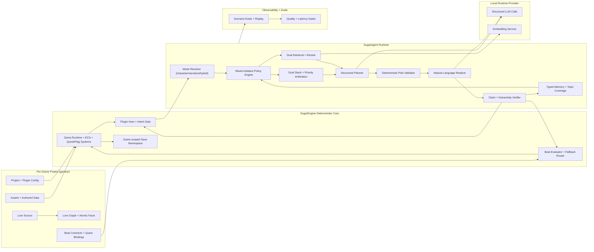

# SugarAgent Strategic Architecture: Final Dual-Mode Target

## Status

Canonical strategic architecture for SugarAgent.

## Date

2026-03-04

## Purpose

This is the top-level architecture contract for SugarAgent.

It defines the final target state for two equally supported NPC experiences:

1. Character-consistent open conversation (no quest beat to deliver).
2. Authored narrative beat delivery with natural variation (quest/story NPCs).

This document is above ADR execution detail and above code-level design.

## Product Outcomes

1. NPCs feel like coherent world characters with stable identity.
2. Lore and identity claims are evidence-grounded, not fabricated.
3. Quest/story beats are delivered naturally while progression remains deterministic.
4. Non-beat NPC conversation remains natural until knowledge is exhausted, then exits gracefully without hallucination.
5. No legacy split-path drift in production correctness logic.
6. NPCs can act with mixed initiative (proactive or reactive) according to policy, without violating grounding or deterministic progression.

## Core NPC Modes

Every NPC runs one mode per turn:

1. `character`:
   - No active authored beat contract.
   - Goal: coherent, grounded conversation as a world character.
   - Must never invent unsupported facts to keep talking.
2. `narrative`:
   - Active authored beat contract bound by quest/objective state.
   - Goal: deliver required narrative information with natural phrasing variation.
   - Quest progression only through deterministic engine checks.
3. `hybrid`:
   - Character interaction with opportunistic beat injection when a contract is active.
   - Deterministic beat rules still win on completion/fallback.

Mode is resolved each turn from:

- NPC `interactionMode` configuration,
- active quest/objective beat context,
- engine policy (scripted-first, agent-first, or fallback policy).

## Final Architecture Contract (Hard Requirements)

The following are mandatory in final production architecture:

1. Canonical lore graph and atomic fact store at ingest time:
   - stable `factId`,
   - typed entities/relations,
   - provenance spans into source text.
2. Canonical beat graph at ingest/load time:
   - stable `beatId`,
   - objective bindings,
   - completion/fallback rules,
   - required/forbidden fact references.
3. Dual retrieval stack on knowledge turns:
   - lexical BM25,
   - vector ANN,
   - both scoped by game and identity (`self`, `related`, `world`, `beat`).
4. Mandatory learned reranker (cross-encoder or equivalent) over merged candidates before planning.
5. Structured planner emits explicit claim/act objects linked to `factId` (and `beatId` when narrative mode is active).
6. Realizer may only verbalize approved claims/acts; style/persona is isolated from factual selection.
7. Entailment-style claim verification against evidence spans; unsupported claims are dropped or converted to abstention.
8. Typed memory system with provenance/confidence and vector recall:
   - `player_fact`,
   - `shared_event`,
   - `npc_commitment`,
   - `relationship_state`,
   - `topic_coverage` (conversation exhaustion tracking).
9. Deterministic engine beat evaluator is authoritative for completion, failure, and scripted fallback.
10. Production release gates are strict and blocking:
    - hallucination rate,
    - ownership leakage,
    - citation coverage,
    - beat completion correctness,
    - fallback correctness,
    - latency budgets.
11. No legacy dialogue path, no toggle split-path for correctness, and no regex-only truth layer in production.
12. Evidence-pack budget policy is explicit and enforced:
    - max facts,
    - max spans,
    - max context tokens,
    - deterministic truncation order.
13. Retrieval quality evaluator is mandatory and bounded:
    - one corrective retrieval attempt max,
    - then clarify/abstain.
14. `factId` stability and provenance durability are versioned platform contracts, not best-effort behavior.
15. Reranker cost is budgeted and observable with cache strategy as a first-class control.
16. Heuristic-only reranking is not an acceptable production correctness path.
17. Deployment gates must be computed from architecture-aligned eval stacks:
    - atomic factual support metrics (FActScore-like),
    - RAG pipeline metrics (RAGAs-like),
    - curated human-labeled regression suite.
18. Mixed-initiative control plane is mandatory:
    - per-turn initiative decision (`npc_initiate`, `player_respond`, `clarify`, `abstain`, `close`),
    - goal arbitration across character, narrative, and repair objectives,
    - deterministic policy bounds validated before realization.

## Architecture Invariants (Non-Negotiable)

1. Engine authority is deterministic:
   - quests, flags, inventory, world state, and progression are engine-owned.
2. SugarAgent is optional and plugin-scoped:
   - removing the plugin does not break scripted gameplay.
3. Game content is project-isolated:
   - per-game project roots, no cross-title content bleed.
4. Knowledge correctness is evidence-first:
   - no accepted factual claim without evidence linkage.
5. Identity ownership is contract-enforced:
   - NPC self facts, player facts, world facts, and beat facts are distinct channels.
6. Abstention is first-class:
   - uncertainty is valid when evidence is weak.
7. Narrative delivery is deterministic at progression boundary:
   - expression can vary, completion cannot.
8. Initiative is policy-driven and bounded:
   - proactive NPC moves are allowed when policy selects them,
   - initiative may not bypass evidence, ownership, beat, or safety constraints.

## Final System Topology



## Canonical Data Architecture

### A) Project Isolation

Final structure is project-per-game:

```text
games/<gameId>/
  project.sgrgame
  assets/
  config/
  plugins/sugaragent/
    lore/generated/
    beats/generated/
```

Rules:

- all runtime content resolves from project context,
- all saves are `gameId`-namespaced,
- no game-specific runtime content in shared root `public/`.

### B) Lore Graph + Atomic Fact Store

At ingest time, lore is transformed into:

- entity graph,
- relation edges,
- atomic fact records (`factId`, subject, predicate, object),
- provenance spans (source file + span offsets).

Runtime never treats raw free text as canonical truth without normalization into facts.

### B1) FactId Stability and Provenance Durability Contract

Because verification depends on durable identifiers and evidence spans, data durability is a core platform concern.

Required controls:

1. Lore artifact versioning:
   - `loreSchemaVersion`,
   - `loreArtifactVersion`,
   - source commit hash.
2. Stable fact identity policy:
   - `factId` must remain stable across non-semantic source edits.
   - semantic changes require a new `factId` with deprecation link metadata.
3. Provenance anchoring policy:
   - store both byte/character offsets and a resilient textual anchor hash.
   - if offsets drift, anchor matching attempts deterministic reattachment.
4. Drift fallback policy:
   - if provenance cannot be reattached with required confidence, mark fact `verification_unavailable`.
   - such facts cannot satisfy strict verification for production responses.
5. Migration policy:
   - maintain mapping records (`oldFactId -> newFactId`) for artifact upgrades.
   - eval replay tooling must understand these mappings.

### C) Beat Contract Graph

Beat contracts are authored data owned by engine quest/objective logic.

Canonical beat contract shape (conceptual):

```ts
interface AgentBeatContract {
  beatId: string;
  questId: string;
  objectiveId: string;
  npcId: string;
  requiredFactIds: string[];
  forbiddenFactIds?: string[];
  completionRule: "player_ack" | "player_action" | "engine_flag";
  completionTarget?: string;
  maxTurns: number;
  fallbackScriptId?: string;
  variationProfile?: "neutral" | "warm" | "urgent" | "mysterious";
}
```

### D) Typed Memory Model

Memory records are typed, attributed, and confidence-scored:

- `player_fact`
- `shared_event`
- `npc_commitment`
- `relationship_state`
- `topic_coverage`

Memory retrieval uses ownership filters plus vector recall.

### E) Mixed-Initiative Policy State and Goal Stack

Mixed initiative is implemented as a first-class policy/data layer, not prompt-only behavior.

Policy state includes:

- recent initiative history (who led, how often, and with what result),
- unresolved player questions,
- active beat urgency and remaining turn budget,
- topic novelty and exhaustion state,
- safety and uncertainty signals.

Goal arbitration stack (conceptual):

```ts
type GoalType =
  | "beat_goal"
  | "character_goal"
  | "social_goal"
  | "repair_goal"
  | "closure_goal";

interface GoalState {
  goalType: GoalType;
  priority: number;
  reason: string;
  expiresAtTurn?: number;
}
```

Per-turn policy output (conceptual):

```ts
interface InitiativeDecision {
  initiator: "npc" | "player";
  action: "npc_initiate" | "player_respond" | "clarify" | "abstain" | "close";
  primaryGoal: GoalType;
  secondaryGoals?: GoalType[];
  expectedPlayerResponseType?: "free_text" | "ack" | "choice" | "action";
}
```

## Final Runtime Orchestration

Canonical pipeline:

`resolve mode -> initiative policy + goal arbitration -> build evidence pack -> plan -> validate -> realize -> verify -> persist -> deterministic engine evaluate`

### 0) Resolve Mode

Determine `character`, `narrative`, or `hybrid` from NPC settings plus active quest/beat context.

### 0A) Mixed-Initiative Policy and Goal Arbitration

Policy engine decides who should lead the next move and why.

Required behavior:

1. allow proactive NPC openings when policy selects `npc_initiate`,
2. allow reactive player-led turns when policy selects `player_respond`,
3. produce `clarify`, `abstain`, or `close` when evidence/novelty/safety conditions require it.

Policy inputs must include:

- mode (`character`, `narrative`, `hybrid`),
- beat urgency and turn budget (if active),
- unresolved player intent/questions,
- topic novelty and exhaustion state,
- retrieval/verification confidence signals.

Policy output is machine-readable and consumed by planner/validator.

### 1) Build Evidence Pack

Evidence sources:

- lore facts (retrieval + rerank),
- relevant memory facts,
- NPC identity profile,
- player-provided facts,
- beat contract facts (when active).

Each item includes:

- `factId` (or typed memory id),
- ownership channel (`npc|player|world|beat`),
- provenance metadata,
- confidence score.

### 1A) Evidence-Pack Budget Policy (Required)

Evidence pack composition must obey deterministic budgets tuned by mode and intent class.

Required budget controls per turn:

1. `maxFacts`
2. `maxSpans`
3. `maxContextTokens`
4. `maxMemoryFacts`
5. `maxBeatFacts` (for `narrative` and `hybrid`)

Selection/truncation policy:

1. keep highest ownership-safe relevance first,
2. preserve beat-required facts before optional context in narrative turns,
3. preserve recent player facts before distant memory,
4. trim tail candidates deterministically.

Rationale:

- avoids long-context degradation and retrieval dilution,
- keeps latency and token costs predictable.

### 1B) Retrieval Quality Evaluator and Corrective Policy

Before planning, retrieval quality is scored for sufficiency and consistency.

Required evaluator outputs:

1. coverage score (query intent vs selected evidence),
2. conflict score (contradictory evidence risk),
3. confidence score (support quality for expected claim class).

Bounded corrective flow:

1. if quality is below threshold, run one corrective attempt:
   - re-query reformulation and/or
   - narrower scope filter and/or
   - beat-priority rebalance (narrative mode).
2. if still below threshold, planner must produce clarify/abstain behavior.

No unbounded retrieval retries in runtime.

### 1C) Reranker Cost Policy and Caching

Reranking is treated as the primary expensive retrieval stage and must be explicitly budgeted.

Required controls:

1. rerank candidate cap per mode (`character`, `narrative`, `hybrid`),
2. budget tiers (`low`, `standard`, `high`) tied to latency SLOs,
3. deterministic cache key policy including:
   - normalized query,
   - scope filters,
   - artifact version,
   - reranker model version.
4. cache invalidation on lore/beat artifact or model version change.
5. production reranker class must be learned (`cross-encoder` or equivalent); heuristic-only rerank may exist for testing but cannot be the production correctness layer.

Reranker cost/latency must be emitted in turn diagnostics.

### 2) Structured Planning

Planner outputs machine-checked plan objects, not free-form response text:

- `initiator` and `initiativeDecision`,
- `primaryGoal` and optional secondary goals,
- `speechAct`,
- `claims[]` linked to `factId`,
- optional `beatActs[]` linked to `beatId`,
- optional `questionBack`,
- optional `memoryWrites`,
- optional `expectedPlayerResponseType`.

### 3) Deterministic Plan Validation

Validation enforces:

- fact existence and ownership compatibility,
- identity rules (no NPC->player leakage),
- beat contract constraints in `narrative`/`hybrid` mode,
- initiative policy bounds (for example, no forced proactive interruption when policy says respond/close),
- no unsupported completion claims.

Invalid plans get one bounded repair attempt, then degrade to safe uncertainty/clarification.

### 4) Realization (Natural Variation Layer)

Realizer converts approved plan to speech with controlled variation:

- persona/tone style shaping,
- phrasing diversity,
- discourse-level coherence with recent turns.

Variation boundary:

- wording can vary,
- approved factual and beat content cannot change.

### 5) Final Verification

Verifier checks:

- entailment support for each factual statement,
- ownership correctness,
- no extra factual units introduced by realization.

Failing output is rewritten from plan or replaced with abstention-safe response.

### 6) Persist Typed Memory + Coverage State

Persist allowed memory events and topic coverage markers only.

Never infer new player traits unless explicitly stated by the player.

### 7) Engine Deterministic Evaluation

Engine evaluates:

- proposed intents through action gate,
- beat evidence against completion rules,
- turn budget overflow and scripted fallback routing.

Only engine may mark beat/objective completion.

## Mode-Specific Behavior Contracts

### Character Mode (No Active Beat)

Target behavior:

- stay in character,
- answer from grounded world/self/player evidence,
- ask clarifying questions when under-specified,
- avoid fabricated continuity.

Initiative rules:

- NPC may initiate naturally when it improves coherence (for example, follow-up question or topic transition),
- NPC must not force repetitive proactive loops after novelty exhaustion.

Conversation exhaustion handling (required):

1. Track `topic_coverage` and novelty score per topic.
2. When no grounded novel content remains:
   - state limits naturally,
   - offer adjacent grounded topics or actionable follow-up,
   - avoid looping identical phrases.
3. If player repeats exhausted requests, degrade politely without hallucinating.

### Narrative Mode (Active Beat)

Target behavior:

- deliver authored narrative requirements with natural language variation,
- remain coherent with character voice,
- preserve deterministic quest progression boundaries.

Initiative rules:

- NPC may proactively open or steer with beat-driven intent when policy selects `npc_initiate`,
- initiative remains constrained by beat budget, coverage state, and completion rules,
- proactive beat steering cannot claim completion without deterministic engine evaluation.

Required beat outputs per turn:

- `beatEvidence.beatId`
- `coveredFactIds[]`
- `uncoveredFactIds[]`
- `completionSignal`
- `confidence`

Deterministic fallback:

- if `maxTurns` exceeded or confidence remains below threshold, engine routes to `fallbackScriptId` (when configured).

### Hybrid Mode

Target behavior:

- allow natural small-talk while still advancing beat obligations.

Arbitration rule:

- beat-critical requirements preempt optional social elaboration near turn budget limits.
- initiative controller balances social responsiveness with beat urgency rather than hard-coding one path.

## Quality Gates (Deployment Blocking)

Production deploy is blocked if any gate fails.

Global gates:

1. Unsupported factual claim rate on knowledge turns: `<= 1.0%`.
2. Ownership leakage (NPC lore attributed to player without evidence): `<= 0.2%`.
3. Evidence/citation coverage on accepted claims: `>= 95%`.
4. Unanswerable handling quality: `>= 90%`.
5. Latency budgets:
   - `character` path p95: `<= +5%` over baseline,
   - `narrative` path p95: `<= +35%` over baseline.

Narrative gates:

1. Beat completion false-positive rate: `<= 0.5%`.
2. Required beat fact coverage before completion: `>= 99%`.
3. Fallback correctness on turn-budget overflow: `>= 99%`.

Character gates:

1. Repetition loop rate after topic exhaustion: `<= 2%`.
2. Exhaustion handling quality (graceful close without fabrication): `>= 90%`.

Initiative gates:

1. Inappropriate proactive interruption rate: `<= 2%`.
2. Dead-air recovery quality (agent restarts stalled conversation appropriately): `>= 90%`.
3. Beat-opener appropriateness in narrative mode (opens or steers with relevant beat intent when required): `>= 95%`.

## Evaluation Stack (Gate Computation Contract)

Release gates are computed from three mandatory evaluation layers:

1. Atomic factual support layer (FActScore-like):
   - measures claim-level evidence support and unsupported-claim rate.
2. RAG pipeline layer (RAGAs-like):
   - measures retrieval precision/recall proxies, faithfulness, and answer relevance.
3. Human-labeled regression layer:
   - curated scenario suite for identity leakage, beat progression correctness, fallback behavior, conversation exhaustion quality, and mixed-initiative quality.

Policy:

1. no single metric family can override failures in another family,
2. regression scenarios are versioned and required in pre-release runs,
3. deployment is blocked if any mandatory gate from any layer fails.
4. learned reranker deployment is blocked unless it meets or exceeds the project retrieval-relevance baseline against the current heuristic control in the curated regression set.

## Governance (Anti-Drift Rules)

Any new feature must document:

1. Which mode(s) it affects.
2. Which invariants it depends on.
3. Where deterministic authority lives (engine vs plugin).
4. How evidence/ownership is enforced before realization.
5. Which release gate metric proves value.
6. Which temporary logic is removed.
7. How initiative policy behavior is affected and validated (if conversational flow changes).

Non-compliant proposals:

- "we can patch it after generation,"
- "regex-only truth checks are enough,"
- "temporary split path in production."

## Relationship To ADRs

This is the strategic umbrella. ADRs define implementation decisions:

- Engine/plugin boundary and deterministic gate: ADR-024.
- Multi-project content isolation: ADR-025.
- Beat contract and deterministic evaluation: ADR-005, ADR-010.
- In-engine provider wiring: ADR-011.
- Identity-aware retrieval: ADR-012.
- Claim validation: ADR-013.
- Optional rewrite pass exploration: ADR-014.
- Hybrid intent routing: ADR-015.
- Evidence-first dialogue architecture: ADR-016.
- Dual-mode NPC model: ADR-017.
- Mixed-initiative policy and goal arbitration: ADR-018.
- Evidence-pack governance and corrective retrieval: ADR-019.
- Fact/provenance durability contract: ADR-020.
- Beat control plane and deterministic progression boundary: ADR-021.
- Evaluation stack and deployment gate governance: ADR-022.

This doc changes only for strategic architecture changes.
ADRs change for implementation plans and sequencing.

## References

### Internal

- [ADR-024: Plugin Architecture](../../../../../docs/adr/024-plugin-architecture.md)
- [ADR-025: Multi-Project Game Architecture](../../../../../docs/adr/025-multi-project-architecture.md)
- [ADR-005: Dialogue Orchestration and Intent Gating](../adr/005-dialogue-orchestration-and-intent-gating.md)
- [ADR-010: In-Engine Runtime Integration and NPC Authoring Surface](../adr/010-in-engine-runtime-integration-and-npc-authoring-surface.md)
- [ADR-011: In-Engine LLM Provider Wiring](../adr/011-in-engine-llm-provider-wiring.md)
- [ADR-012: Identity-Aware Lore Retrieval](../adr/012-identity-aware-lore-retrieval.md)
- [ADR-013: Evidence-Based Claim Validation](../adr/013-evidence-based-claim-validation.md)
- [ADR-014: Optional Constrained Grounded Rewrite Pass](../adr/014-optional-constrained-grounded-rewrite-pass.md)
- [ADR-015: Hybrid Intent Routing and Evidence Policy](../adr/015-hybrid-intent-routing-and-evidence-policy.md)
- [ADR-016: Evidence-First Dialogue Architecture](../adr/016-evidence-first-dialogue-architecture.md)
- [ADR-017: Dual-Mode NPC Conversation Model](../adr/017-dual-mode-npc-conversation-model.md)
- [ADR-018: Mixed-Initiative Policy and Goal Arbitration](../adr/018-mixed-initiative-policy-and-goal-arbitration.md)
- [ADR-019: Evidence-Pack Governance and Corrective Retrieval](../adr/019-evidence-pack-governance-and-corrective-retrieval.md)
- [ADR-020: Fact ID and Provenance Durability Contract](../adr/020-fact-id-and-provenance-durability-contract.md)
- [ADR-021: Beat Control Plane and Deterministic Progression Boundary](../adr/021-beat-control-plane-and-deterministic-progression.md)
- [ADR-022: Evaluation Stack and Deployment Gate Governance](../adr/022-evaluation-stack-and-deployment-gate-governance.md)
- [Final Architecture Phased Plan](./002-final-architecture-phased-implementation-plan.md)
- [Research: SugarAgent Architecture Proposal v2](../../../../../docs/research/sugar_agent_architectural_proposal.md)

### External Research and Prior Art

- Lewis et al., Retrieval-Augmented Generation (RAG), NeurIPS 2020: https://arxiv.org/abs/2005.11401
- Robertson and Zaragoza, BM25 and probabilistic relevance framework: https://dl.acm.org/doi/10.1561/1500000019
- Johnson et al., FAISS for vector similarity search: https://arxiv.org/abs/1702.08734
- Malkov and Yashunin, HNSW ANN indexing: https://arxiv.org/abs/1603.09320
- Nogueira and Cho, passage reranking with BERT cross-encoder: https://arxiv.org/abs/1901.04085
- Yao et al., ReAct, ICLR 2023: https://arxiv.org/abs/2210.03629
- Asai et al., Self-RAG, 2023: https://arxiv.org/abs/2310.11511
- Yan et al., CRAG, 2024: https://arxiv.org/abs/2401.15884
- Gao et al., RARR, ACL 2023: https://aclanthology.org/2023.acl-long.910/
- Min et al., FActScore, EMNLP 2023: https://aclanthology.org/2023.emnlp-main.741/
- Es et al., RAGAs, EACL 2024: https://aclanthology.org/2024.eacl-demo.16/
- Liu et al., Lost in the Middle, TACL 2024: https://aclanthology.org/2024.tacl-1.9/
- Scholak et al., PICARD, EMNLP 2021: https://aclanthology.org/2021.emnlp-main.779/

Game-engine prior art for project/content isolation:

- Unity Addressables content packaging: https://docs.unity3d.com/Manual/com.unity.addressables.html
- Unreal Asset Management / Primary Asset workflows: https://dev.epicgames.com/documentation/en-us/unreal-engine/asset-management-in-unreal-engine
