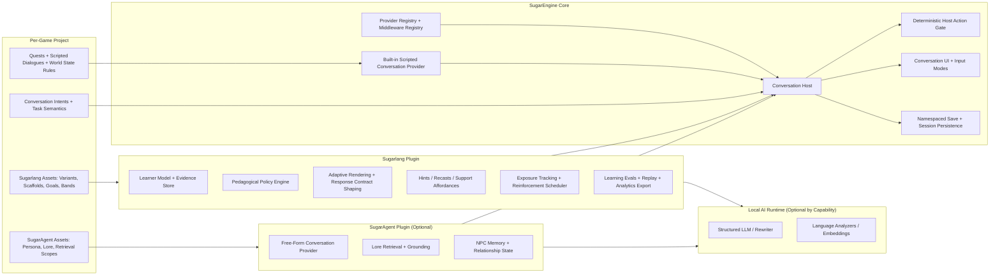

# Sugarlang Strategic Architecture

## 1) Purpose

This document defines the final production architecture for a **separate** `sugarlang` plugin that delivers adaptive language-learning behavior in SugarEngine.

It is intentionally a **system design document**, not an implementation plan.

It describes the end state where:

- `sugarlang` is its own plugin with its own save namespace, authoring surface, evals, and runtime services
- `sugaragent` is optional
- `sugarlang` works with the existing scripted dialogue + quest systems
- `sugarlang` can also augment optional free-form conversation when `sugaragent` is enabled
- English-authored game content remains the primary creative input
- the language-learning layer is generated and refined as a separate overlay
- the same Sugarlang authoring artifacts can be used from the editor, an external AI assistant in chat, or direct structured-file editing
- engine core remains generic and does not hardcode either plugin

This architecture builds on the product goals in [LANGUAGE_LEARNING_PRODUCT_ROADMAP.md](../research/LANGUAGE_LEARNING_PRODUCT_ROADMAP.md), which is retained as historical product research context. The binding product and delivery contracts now live in the Sugarlang product docs, ADRs, and phased implementation plan.

## 2) Non-Negotiable Outcomes

1. `sugarlang` must be a distinct plugin, not a feature flag inside `sugaragent`.
2. `sugaragent` must be optional and removable without breaking language-learning mode.
3. Scripted games must be able to use `sugarlang` without any LLM-driven free-form conversation.
4. Engine-owned gameplay authority must remain deterministic:
   - quests
   - objectives
   - flags
   - inventory
   - scripted dialogue progression
5. No plugin may directly mutate canonical game state outside engine-owned host actions.
6. `sugarlang` and `sugaragent` must not call each other directly.
7. Composition between plugins must happen only through engine-owned conversation contracts and middleware stages.
8. The learner model, turn evidence model, telemetry model, and evaluation stack must be provider-independent.
9. English-authored quests and dialogues must remain the primary authoring input for game content.
10. Sugarlang authored/generated language-learning data must be stored as human-readable files under the game root.
11. SQLite or other local databases may be used for caches, indexes, replay artifacts, or analytics staging, but not as the source of truth for authored Sugarlang content.
12. The editor UI must not be the only authoring workflow; external chat-based AI assistance and direct structured-file editing must operate on the same underlying files and contracts.
13. Support-language policy and scene-grounding metadata must be first-class authoring and runtime concepts, not ad hoc UI text.
14. The base game content is authored in English, while runtime language behavior is driven by target language and support language.
15. Mixed-language initial delivery, repair, and happy-path response frames must be scene-authored/runtime-controlled and must not collapse into always-on translation strips or arbitrary token-spliced UI text.

## 3) Architecture Thesis

The correct final shape is:

- **engine-owned conversation orchestration**
- **provider-based turn production**
- **middleware-based turn adaptation, validation, analytics, and learning updates**

Under that model:

- the **engine** owns the conversation host, provider selection, middleware ordering, UI state, and canonical action execution
- the **scripted dialogue system** is exposed as an engine-owned conversation provider
- **`sugaragent`** is an optional free-form conversation provider
- **`sugarlang`** is a plugin that primarily participates as conversation middleware and learning runtime, with optional internal rendering/analyzer services for scripted adaptation

This is the key separation that allows `sugarlang` to work in both deployment modes:

- scripted-only language learning
- language learning plus optional free-form conversation

## 4) Research and Standards Basis

This architecture is grounded in a small set of standards and production architecture references:

- The CEFR framework and Companion Volume materials treat language ability as multidimensional across reception, production, interaction, and mediation, which supports a richer learner model than a single coarse level label.[^cefr]
- Ordered middleware pipelines are a mature extensibility pattern; Microsoft’s middleware guidance is directly relevant to the need for deterministic stage ordering, short-circuit control, and cross-cutting concerns around a core request flow.[^middleware]
- NIST’s AI Risk Management Framework supports treating evaluation, monitoring, and governance as first-class architecture concerns rather than post-hoc cleanup.[^airmf]
- The NIST Privacy Framework supports data minimization, separate data handling boundaries, and privacy-by-design for learner telemetry and transcript data.[^privacy]
- OpenTelemetry provides the right production model for turn-level traces across providers, validators, analyzers, and persistence paths.[^otel]
- 1EdTech Caliper provides a useful target shape for learning-event semantics and future export interoperability.[^caliper]

Detailed pedagogical policies, language-specific analyzers, and scoring rubrics belong in follow-on ADRs. This document only defines the architectural shape that can host them.

## 5) Final System Topology

## 6) Core Architectural Layers

### 6.1 Narrative and Progression Layer

Engine-owned.

This layer remains the canonical source of truth for:

- quests
- dialogue graphs
- objective completion
- state gates
- world mutations

It should not become pedagogy-aware and it should not become `sugaragent`-aware.

### 6.2 Conversation Semantics Layer

Shared authored contract, hosted by the engine and consumable by providers and middleware.

This layer exists so both scripted dialogue and free-form dialogue can refer to the same underlying conversational meaning.

Examples:

- task objective identifiers
- semantic conversation intents
- expected player response categories
- slot/value requirements
- stable scenario referents and optional band-specific concrete variants
- visible referents and their relevant attributes
- spatial relations that can be grounded in the scene
- scene-level success criteria

Without this layer, `sugarlang` cannot operate consistently across both scripted and free-form modes.

### 6.3 Turn Provider Layer

The provider layer is responsible for producing the next turn in a normalized conversation format.

Final-state providers are:

- the engine-owned scripted conversation provider
- the optional `sugaragent` provider

Exactly one provider owns turn production for a given turn.

### 6.4 Conversation Middleware Layer

The middleware layer wraps provider execution.

It exists for cross-cutting concerns that must work regardless of which provider produced the turn.

That includes:

- learner-state lookup
- pedagogical policy selection
- support-language policy selection
- response-mode shaping
- initial-delivery, repair, and happy-path response-frame shaping
- staged repair-control visibility and repair-ladder progression
- natural mixed-language rendering policy
- grounding-aware adaptation and hinting
- adaptive rendering constraints
- pedagogical validation
- post-turn evidence extraction
- analytics emission

`sugarlang` belongs here.

### 6.5 Rendering and Interaction Layer

Engine-owned UI surfaces should render:

- the NPC utterance
- response affordances
- response frames, word banks, and insert helpers where applicable
- repair responses and clarification affordances
- support affordances
- correction/hint requests
- typing constraints when applicable

This layer must consume a normalized response contract rather than special-casing one plugin.

At typed bands, the rendering layer must also distinguish between:

- visible support scaffolds that are part of the first-response surface
- stronger repair controls that are revealed after failure

For `B2`, the expected interaction ladder is:

1. initial typed turn
   - text box plus a small visible insert tray
2. first and second failure
   - reveal `Show me more words`
   - reveal `Say it more simply`
3. third failure
   - add `Say it in {supportLanguage}` as the final rescue

That means repair authoring cannot be modeled as a single always-visible button list. The architecture must support authored repair options plus runtime visibility rules.

### 6.6 Authoring and Draft Generation Layer

The final architecture must include a first-class authoring layer, not just a runtime layer.

That layer should support an English-first workflow:

- the creator authors quests, dialogue, NPCs, and world setup as a normal game
- `sugarlang` derives a semantic learning overlay from that authored structure
- `sugarlang` derives candidate grounding maps from the authored scene objects, regions, and attributes
- `sugarlang` defines stable scenario-level referents and optional per-band concrete variants for grounded quest scenes
- `sugarlang` scene language packs own the actual initial-delivery lines, repair variants, and happy-path response frames by learner band
- AI drafts most of the language-learning metadata and language-specific variants
- the creator refines the draft in the editor, in chat, or through scripted tooling

The critical architecture point is that the editor is only one client of this authoring system.

The same artifact model and the same on-disk source of truth must be usable from:

- SugarEngine editor actions
- chat-based AI assistance operating on workspace files
- direct structured-file editing

## 7) Required Engine Architecture for Plugin Composition

The engine needs a proper conversation stack.

Not a single plugin hook.

The current first-plugin-wins plugin hooks are not enough for this end state.

The final architecture requires the existing scripted and SugarAgent conversation paths to be migrated behind the same engine-owned host rather than leaving parallel orchestration paths in `Game.ts`.

### 7.1 Engine-Owned Conversation Host

The engine should own a generic `ConversationHost` equivalent that is responsible for:

- opening and closing sessions
- selecting the active provider for a turn
- running the middleware chain
- collecting host action proposals
- rendering the resulting UI contract
- executing validated deterministic actions
- persisting normalized transcript and session artifacts

This host must replace any `Game.ts` behavior that still understands `sugaragent`-specific semantics directly.

It must also absorb the current first-plugin-wins interaction and turn path so the engine no longer has one legacy path for existing conversations and another path for Sugarlang-aware conversations.

### 7.2 Capability-Based Registration

Plugins should register by capability, not by hardcoded plugin name.

At minimum, the architecture needs two distinct capabilities:

- `conversation.provider`
- `conversation.middleware`

This is the clean boundary that makes `sugaragent` and `sugarlang` composable while remaining separate plugins.

### 7.3 Ordered Middleware Pipeline

Middleware execution order must be explicit and engine-owned.

It must not be an accident of plugin registration order.

The recommended high-level stage model is:

1. context hydration
2. learner/policy contribution
3. provider invocation
4. output validation and repair/downgrade
5. post-turn analysis and persistence
6. analytics and telemetry emission

That stage discipline is necessary because middleware ordering changes behavior, and ordered pipelines are only reliable when the host owns the order.[^middleware]

### 7.4 Provider-Independent Turn Envelope

Both scripted dialogue and `sugaragent` must participate in the same conceptual turn envelope.

That envelope should include both request-side and response-side structure.

Request-side structure should include, at minimum:

- session and trace identity
- scene semantics
- target language and support language
- learner-band context
- stable scenario referent and optional grounded band variant
- mixed-language surface policy for initial delivery, repair, and response scaffolds
- clarification-entry policy
- provider input constraints
- response contract
- failure and recovery posture
- grounding allowances and scene referent scope
- room for middleware annotations

Response-side structure should include, at minimum:

- semantic act or intent identity
- rendered utterance payload
- support-language policy for the turn
- rendered surface classification such as initial delivery, repair, or happy-path response frame
- player response contract
- response-frame or scaffold payload where applicable
- host action proposals
- grounded band variant and provenance when applicable
- provenance/grounding metadata where applicable
- diagnostics
- room for middleware annotations

The point is not to force scripted dialogue to pretend to be an LLM.

The point is to make every turn analyzable and adaptable by the same downstream learning system.

### 7.5 Middleware-to-Provider Constraint Bundle

The engine-mediated handoff from middleware to provider cannot be an unspecified "annotation bag."

The provider must receive a provider-neutral constraint bundle that can carry both hard requirements and advisory preferences.

At the architectural level, that bundle should be able to express:

- communicative task and scene semantics
- target language and support language
- learner-band context and placement state
- support-language policy for the turn, including initial-delivery, repair, and response-scaffold posture
- natural mixed-language rendering requirements
- protected target-language teaching units that must remain visible
- response-contract requirements
- clarification-entry policy
- word-bank or scaffold policy, including whether distractors are allowed
- allowed complexity or vocabulary window
- grounding scope, stable scenario referent, and optional grounded band variant
- feedback and failure-recovery posture
- trace identity and diagnostics context

This is the channel that allows Sugarlang to influence SugarAgent without direct plugin-to-plugin calls.

### 7.6 No Direct Plugin-to-Plugin Calls

`sugarlang` should not import or invoke `sugaragent`.

`sugaragent` should not import or invoke `sugarlang`.

Instead:

- `sugarlang` contributes pedagogical context and validates outcomes through middleware
- `sugaragent` consumes the engine-mediated provider constraint bundle and returns generic provider output
- the engine is the only coordinator

That avoids cross-plugin lock-in and keeps both plugins replaceable.

## 8) Ownership Boundaries

### 8.1 Engine Owns

- canonical world state
- quest/dialogue progression
- provider and middleware orchestration
- session lifecycle
- deterministic action execution
- UI rendering and input capture
- plugin state namespacing and save/load
- normalized transcript persistence

### 8.2 Sugarlang Owns

- learner profile and learner-state updates
- turn evidence extraction and storage
- pedagogical policy selection
- support-language policy selection
- scripted adaptive language assets
- mixed-language initial-delivery lines, repair variants, and happy-path response frames
- scene-grounding maps and grounded vocabulary bindings
- stable scenario-level referents plus per-band concrete grounded variants
- response-mode shaping
- hints, recasts, and support affordances
- vocabulary/structure exposure tracking
- reinforcement scheduling hooks
- learning analytics and learning evals

### 8.3 SugarAgent Owns

- optional free-form conversation generation
- lore retrieval and citation production
- NPC memory and relationship modeling
- provider-specific health/runtime state
- provider-specific grounding and reply realization

### 8.4 Local AI Runtime Owns

- inference only
- optional structured generation
- optional constrained rewriting
- optional embeddings or analyzers

It does not own pedagogy, world state, or progression logic.

## 9) How Sugarlang Works Without SugarAgent

`sugarlang` does not require `sugaragent` if the engine exposes scripted dialogue as a provider and surfaces sufficient conversation semantics.

In the scripted-only deployment profile:

- the scripted provider resolves the current narrative turn
- `sugarlang` middleware chooses the learner-appropriate rendering path
- `sugarlang` chooses the band-appropriate initial-delivery line, repair line, and happy-path response frame
- `sugarlang` chooses how much support language is shown and which target-language teaching units remain visible
- `sugarlang` keeps mixed-language lines natural-sounding and may keep the submitted response fully target-language when that is the more believable in-world surface
- `sugarlang` shapes the player response mode
- `sugarlang` adds hints, repetition, optional translation, grounded highlights, or recast behavior
- engine dialogue progression remains fully scripted and deterministic

In other words:

`sugarlang` can deliver real language-learning functionality without free-form NPC generation.

That is not a degraded architecture.

It is a first-class deployment mode.

## 10) How Sugarlang Works With SugarAgent

When `sugaragent` is enabled, it becomes an optional provider for designated conversations or turns.

`sugarlang` still does not hand off ownership.

Instead:

- `sugarlang` computes learner-state and pedagogical policy
- the engine passes that policy into the selected provider as generic constraints
- `sugaragent` generates a structured turn inside those bounds
- `sugarlang` validates pedagogical fit and updates learner evidence after the turn

This means the language-learning system stays stable even if the turn provider changes.

The provider changes.

The learning architecture does not.

## 11) Shared Authored Data Model

The final architecture needs four distinct authored data layers.

### 11.1 Narrative Data

Engine-owned.

Examples:

- quests
- objectives
- scripted node progression
- world-state gates

### 11.2 Conversation Semantics

Shared contract layer.

Examples:

- scene objective ids
- conversation intent ids
- expected response type
- success conditions
- semantic slot requirements

### 11.3 Sugarlang Data

Plugin-owned language-learning assets.

Examples:

- learner-band render variants
- vocabulary/grammar tags
- support affordances
- hint assets
- feedback policies
- micro-goal definitions
- exposure/reinforcement metadata

### 11.4 SugarAgent Data

Plugin-owned free-form assets.

Examples:

- persona
- tone
- lore scopes
- safety bounds
- retrieval config
- NPC-specific agent behavior profiles

This separation is what prevents either plugin from becoming the authoring owner of the whole game.

### 11.5 English-First Authoring Model

The intended creator workflow is:

1. author the game scene in English using normal SugarEngine quest/dialogue workflows
2. bind that authored scene to a Sugarlang semantic scenario
3. generate target-language drafts for learner bands
4. refine those drafts over time

This matters because the solo creator should not be forced to manually invent every pedagogical field from scratch.

The system should assume that:

- the creator knows the game they want to make
- the system helps derive the language-learning layer
- the creator reviews and edits drafts rather than hand-authoring every low-level pedagogical artifact

### 11.6 Sugarlang Source-of-Truth Storage Model

The canonical on-disk layout is defined in [ADR-SL-001](../adr/001-english-first-authoring-overlay-and-source-of-truth-model.md).

This architecture depends on that layout providing these ownership classes:

- project-level plugin enablement and high-level language configuration
- scenario-owned semantic briefs and grounding maps
- shared defaults
- per-target-language lexicon, grammar, and scene packs
- optional generated intermediates
- eval fixtures and reports
- disposable caches or local database artifacts

SQLite and similar local stores may be useful for:

- search indexes
- preview caches
- analyzer caches
- replay query performance

They should not be the canonical location of authored learning content.

For the initial shipped product, the first complete player-facing language pairs should be:

- English support -> Spanish target
- Spanish support -> English target

### 11.7 Authoring Clients and Shared Draft Generation

The architecture should support multiple authoring clients over the same Sugarlang model.

Those clients are:

- editor-driven authoring
- external chat-driven AI authoring
- direct structured-file editing

All of them should use the same underlying capabilities:

- scene extraction from authored quest/dialogue content
- scenario drafting
- learner-band draft generation
- regeneration of selected bands or languages
- validation
- round-trip-safe file writes

This means a creator should be able to do either of the following:

- click `Generate Sugarlang Draft` in the editor
- ask an AI assistant in chat to generate the draft for a quest or scene

and receive equivalent Sugarlang artifacts on disk.

### 11.8 Authoring Data Flow

The authoring data flow should look like this:

1. Creator authors or updates English quest/dialogue content.
2. Sugarlang scene extraction reads the authored structure and resolves stable references.
3. Draft generation produces or updates Sugarlang scenario files, grounding maps, and per-language scene packs, and may suggest shared lexicon or grammar-pack updates.
   - those scenario files should preserve stable scenario referents and any band-specific concrete variant map
   - those scene packs should preserve the actual initial-delivery lines, repair variants, and happy-path response frames
4. Validation checks references, response contracts, and evaluation rules.
5. Creator reviews and refines in editor or via chat.
6. Preview and eval operate on the same saved artifacts.

## 12) Required Runtime Data Flows

### 12.1 Scripted-Only Language Learning Flow

1. Player enters a conversation controlled by the scripted provider.
2. Engine opens a normalized conversation session.
3. `sugarlang` middleware loads learner state and scene pedagogy context.
4. Scripted provider resolves the next semantic turn from the authored dialogue graph.
5. `sugarlang` selects or renders the appropriate initial-delivery or repair variant, response frame, response contract, and grounded band variant.
6. Engine renders the turn and allowed player-input mode.
7. Player responds through the constrained or scripted interaction mode.
8. `sugarlang` extracts turn evidence, updates learner state, records exposures, and emits learning analytics.
9. Engine advances scripted dialogue and quest state through deterministic rules.

### 12.2 Agent-Assisted Language Learning Flow

1. Player enters a conversation or turn configured for the `sugaragent` provider.
2. Engine opens the normalized conversation session.
3. `sugarlang` computes pedagogical policy from learner state, scene objective, and prior evidence.
4. Engine passes the provider constraint bundle into the selected provider, including scene semantics, learner-band context, target/support language, mixed-language posture, response-contract requirements, grounding scope, grounded variant focus, and failure-recovery posture.
5. `sugaragent` produces the turn with its own lore, memory, and grounding systems.
6. Engine validates proposed host actions and grounding outputs through generic host contracts.
7. `sugarlang` evaluates pedagogical fit, attaches support affordances, and updates learner evidence.
8. Engine renders the result and applies any validated deterministic actions.

### 12.3 Hybrid Scene Flow

The architecture should support scenes that mix:

- scripted turns
- constrained learner production
- optional `sugaragent` turns

The provider may change by scene or by turn.

The learner model and evidence model should not.

## 13) Pedagogical Logic Flow

The `sugarlang` runtime should follow one provider-independent loop:

1. read current learner state
2. read narrative/scene semantics
3. derive pedagogical target for this turn
4. derive response constraints, support level, and the natural mixed-language surface for initial delivery, repair, and happy-path response scaffolds
5. let the selected provider realize the turn
6. evaluate the player outcome and provider output
7. update learner state and reinforcement scheduling
8. emit analytics and replay artifacts

That loop is the stable core of the plugin.

The provider is replaceable.

The learning loop is not.

## 14) Response Modes and Input Contracts

The engine must support response contracts as a native concept.

That is necessary because `sugarlang` needs to control not only what the NPC says, but also what kind of answer the player is being asked to produce.

At a high level, the architecture must support:

- choice-based response
- confirmation/acknowledgement
- fill-in or short constrained text
- short free-form text
- open free-form text
- hint or explanation request
- repeat or simplify request

These are not UI flourishes.

They are part of the pedagogical contract for a turn.

## 15) Sugarlang Internal Runtime Responsibilities

The internal Sugarlang runtime should be designed as four cooperating services.

### 15.1 Learner Runtime

Owns:

- learner profile
- learner-state inference
- confidence handling
- trend smoothing

### 15.2 Pedagogy Runtime

Owns:

- target difficulty selection
- support level selection
- correction mode selection
- response-mode selection

### 15.3 Adaptation Runtime

Owns:

- scripted utterance adaptation
- candidate filtering
- optional constrained rewriting
- pedagogical validation

### 15.4 Learning Record Runtime

Owns:

- exposure logs
- turn evidence logs
- progression snapshots
- replay artifacts
- exportable learning events

Those services are internal to `sugarlang`.

They should not leak into engine core or `sugaragent`.

## 16) Persistence Model

The persistence boundary should remain namespaced.

Authored Sugarlang content is not the same thing as runtime save state.

Authored or AI-generated learning overlays should live under the game root in Sugarlang-owned files.

Save data should only contain runtime state needed to resume play.

Local databases may exist for caches or analytics support, but they should be disposable and rebuildable from the authored files plus runtime traces.

### Engine Session State

Engine-owned:

- active conversation session
- selected provider
- active dialogue node or scene handle
- validated host actions

### Sugarlang Save State

Plugin-owned:

- learner state
- turn evidence history
- exposure/mastery records
- reinforcement schedule data
- learning snapshots
- export cursors

### SugarAgent Save State

Plugin-owned:

- NPC memory
- relationship state
- provider runtime health
- provider session memory

The engine may persist normalized transcript envelopes for replay and debugging, but plugin-private state must remain plugin-private.

## 17) Observability, Analytics, and Evaluation

Production deployment requires provider-independent observability.

### 17.1 Turn Tracing

Every turn should produce one trace with spans for:

- provider selection
- middleware stages
- provider execution
- host validation
- learner update
- persistence

OpenTelemetry is the right model for this kind of cross-component tracing.[^otel]

### 17.2 Learning Event Semantics

Learning events should be captured in a stable internal schema that can be mapped to Caliper-compatible exports for downstream analysis.[^caliper]

Examples:

- prompt delivered
- response type requested
- response submitted
- help requested
- correction provided
- objective achieved
- vocabulary/structure exposure recorded

### 17.3 Replay and Evaluation

The replay harness must consume normalized conversation envelopes rather than provider-specific raw logs.

That is required so the same evaluation stack can score:

- scripted-only runs
- `sugaragent` runs
- hybrid runs

NIST AI RMF is a strong architectural justification for making evaluation, monitoring, and governance part of the deployed system instead of a separate research project.[^airmf]

## 18) Privacy and Governance

Language-learning systems produce learner-performance data.

That makes privacy architecture mandatory, not optional.

The production design should assume:

- learner data is more sensitive than ordinary gameplay telemetry
- raw free-form transcripts may contain personal information
- analytics export must be configurable and consent-aware
- retention and redaction rules must be independent from ordinary save persistence

The NIST Privacy Framework is the right reference point for keeping learner telemetry intentionally scoped and separately governed.[^privacy]

## 19) Why This Is the Right Final Architecture

This architecture is the right production target because it:

- keeps engine core generic
- keeps `sugaragent` optional
- lets `sugarlang` add value in purely scripted games
- supports English-first game authoring for a solo creator
- treats AI draft generation as a first-class authoring path, not an afterthought
- avoids plugin-to-plugin coupling
- makes learner modeling provider-independent
- supports future providers beyond `sugaragent`
- keeps deterministic authority in the engine
- makes evaluation and privacy first-class

Most importantly, it avoids the architectural trap where language learning becomes an accidental feature of the free-form conversation stack.

The correct long-term model is the opposite:

free-form conversation is an optional provider that plugs into a language-learning architecture that stands on its own.

## 20) Intentionally Deferred to Follow-On ADRs

This document does **not** define:

- exact TypeScript interfaces
- exact middleware stage APIs
- exact save schemas
- exact authoring file formats
- exact scoring formulas
- exact model/runtime selections
- exact feedback taxonomy
- exact export protocol details

Those are follow-on ADR topics.

What this document does define is the final architectural shape they must fit.

## Sources

[^cefr]: Council of Europe. *Common European Framework of Reference for Languages (CEFR)*. [https://www.coe.int/en/web/common-european-framework-reference-languages](https://www.coe.int/en/web/common-european-framework-reference-languages)

[^middleware]: Microsoft Learn. *ASP.NET Core Middleware*. [https://learn.microsoft.com/en-us/aspnet/core/fundamentals/middleware/](https://learn.microsoft.com/en-us/aspnet/core/fundamentals/middleware/)

[^airmf]: NIST. *AI Risk Management Framework*. [https://www.nist.gov/itl/ai-risk-management-framework](https://www.nist.gov/itl/ai-risk-management-framework)

[^privacy]: NIST. *Privacy Framework*. [https://www.nist.gov/privacy-framework](https://www.nist.gov/privacy-framework)

[^otel]: OpenTelemetry. *Traces*. [https://opentelemetry.io/docs/concepts/signals/traces/](https://opentelemetry.io/docs/concepts/signals/traces/)

[^caliper]: 1EdTech. *Caliper Analytics*. [https://www.1edtech.org/standards/caliper-analytics](https://www.1edtech.org/standards/caliper-analytics)
