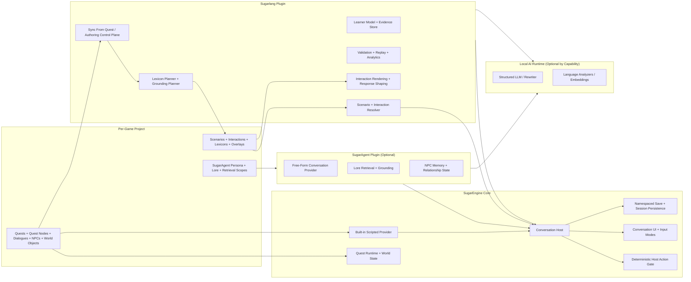
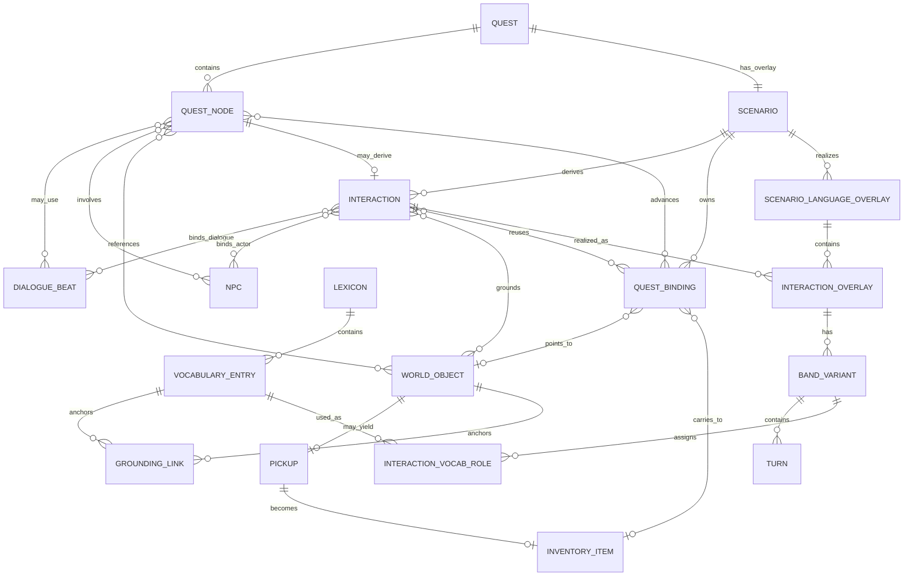

# Sugarlang Strategic Architecture

## 1) Purpose

This document defines the final production architecture for a **separate** `sugarlang` plugin that delivers adaptive language-learning behavior in SugarEngine.

It is intentionally a **system design document**, not an implementation plan.

It describes the end state where:

- `sugarlang` is its own plugin with its own save namespace, authoring surface, evals, and runtime services
- `sugaragent` is optional
- `sugarlang` works with the existing scripted dialogue + quest systems
- `sugarlang` can also augment optional free-form conversation when `sugaragent` is enabled
- English-authored game content remains the primary creative input
- the language-learning layer is generated and refined as a separate overlay
- the same Sugarlang authoring artifacts can be used from the editor, an external workspace assistant operating on bounded packets and files, or direct structured-file editing
- engine core remains generic and does not hardcode either plugin

This architecture builds on the product goals in [LANGUAGE_LEARNING_PRODUCT_ROADMAP.md](../research/LANGUAGE_LEARNING_PRODUCT_ROADMAP.md), which is retained as historical product research context. The binding product and delivery contracts now live in the Sugarlang product docs, ADRs, and phased implementation plan.

## 2) Non-Negotiable Outcomes

1. `sugarlang` must be a distinct plugin, not a feature flag inside `sugaragent`.
2. `sugaragent` must be optional and removable without breaking language-learning mode.
3. Scripted games must be able to use `sugarlang` without any LLM-driven free-form conversation.
4. Engine-owned gameplay authority must remain deterministic:
   - quests
   - objectives
   - flags
   - inventory
   - scripted dialogue progression
5. No plugin may directly mutate canonical game state outside engine-owned host actions.
6. `sugarlang` and `sugaragent` must not call each other directly.
7. Composition between plugins must happen only through engine-owned conversation contracts and middleware stages.
8. The learner model, turn evidence model, telemetry model, and evaluation stack must be provider-independent.
9. English-authored quests and dialogues must remain the primary authoring input for game content.
10. Sugarlang authored/generated language-learning data must be stored as human-readable files under the game root.
11. SQLite or other local databases may be used for caches, indexes, replay artifacts, or analytics staging, but not as the source of truth for authored Sugarlang content.
12. The editor UI must not be the only authoring workflow; external workspace-assistant help and direct structured-file editing must operate on the same underlying files and contracts.
13. Support-language policy and interaction-grounding metadata must be first-class authoring and runtime concepts, not ad hoc UI text.
14. The base game content is authored in English, while runtime language behavior is driven by target language and support language.
15. Mixed-language initial delivery, repair, and happy-path response frames must be interaction-authored/runtime-controlled and must not collapse into always-on translation strips or arbitrary token-spliced UI text.

## 3) Architecture Thesis

The correct final shape is:

- **engine-owned conversation orchestration**
- **provider-based turn production**
- **middleware-based turn adaptation, validation, analytics, and learning updates**

Under that model:

- the **engine** owns the conversation host, provider selection, middleware ordering, UI state, and canonical action execution
- the **scripted dialogue system** is exposed as an engine-owned conversation provider
- **`sugaragent`** is an optional free-form conversation provider
- **`sugarlang`** is a plugin that primarily participates as conversation middleware and learning runtime, with optional internal rendering/analyzer services for scripted adaptation

This is the key separation that allows `sugarlang` to work in both deployment modes:

- scripted-only language learning
- language learning plus optional free-form conversation

## 4) Research and Standards Basis

This architecture is grounded in a small set of standards and production architecture references:

- The CEFR framework and Companion Volume materials treat language ability as multidimensional across reception, production, interaction, and mediation, which supports a richer learner model than a single coarse level label.[^cefr]
- Ordered middleware pipelines are a mature extensibility pattern; Microsoft’s middleware guidance is directly relevant to the need for deterministic stage ordering, short-circuit control, and cross-cutting concerns around a core request flow.[^middleware]
- NIST’s AI Risk Management Framework supports treating evaluation, monitoring, and governance as first-class architecture concerns rather than post-hoc cleanup.[^airmf]
- The NIST Privacy Framework supports data minimization, separate data handling boundaries, and privacy-by-design for learner telemetry and transcript data.[^privacy]
- OpenTelemetry provides the right production model for turn-level traces across providers, validators, analyzers, and persistence paths.[^otel]
- 1EdTech Caliper provides a useful target shape for learning-event semantics and future export interoperability.[^caliper]

Detailed pedagogical policies, language-specific analyzers, and scoring rubrics belong in follow-on ADRs. This document only defines the architectural shape that can host them.

## 5) Final System Topology

## 6) Core Domain Model and Architectural Layers

### 6.1 Narrative and Progression Layer

Engine-owned.

This layer remains the canonical source of truth for:

- quests
- quest stages and quest nodes
- dialogue graphs and English-authored dialogue beats
- objective completion
- state gates
- world mutations
- pickups, inventory, and return loops

It should not become pedagogy-aware and it should not become `sugaragent`-aware.

### 6.2 Sugarlang Domain Model

Sugarlang should not duplicate the quest graph.

It should overlay the quest graph with a smaller set of language-learning entities:

- `Quest`
  - the engine-owned progression graph
- `Scenario`
  - the Sugarlang overlay for one quest
- `Interaction`
  - one learner-facing communicative beat derived from exactly one quest node inside that quest
- `Turn`
  - one exchange inside an interaction
- `Vocabulary Entry`
  - one shared lexicon row in one target language
- `Grounding Link`
  - the link from a vocabulary entry to a world object, region, or attribute
- `Quest Binding`
  - the stable binding that carries one grounded referent through inspect, pickup, inventory, and return

The important product rule is:

- one quest may have one Sugarlang scenario
- one scenario may have many interactions
- interactions, not bands, are the quest-sized communicative units
- bands change how an interaction is rendered, not what the quest truth is

#### Mermaid ERD

#### Plain-English Binding Rules

1. `Quest -> Scenario`
   - a Sugarlang-enabled quest owns one Sugarlang scenario overlay
   - the quest remains the engine-owned source of truth
2. `Scenario -> Interaction`
   - the scenario is broken into learner-facing interactions
   - an interaction is the Sugarlang equivalent of one meaningful quest beat, not one band
3. `Interaction -> source quest data`
   - each interaction binds back to exactly one quest node, plus the English dialogue beats, NPCs, and world objects from that node
4. `Scenario -> Quest Binding`
   - the scenario owns stable grounded bindings for quest-critical referents
   - interactions reuse those bindings rather than inventing new referents mid-quest
5. `Scenario -> target-language overlays`
   - each target language gets one scenario overlay containing interaction overlays
   - each interaction overlay contains band variants and turns
6. `Lexicon -> interaction roles`
   - lexicons stay shared per target language for the whole game
   - interactions assign current `focus`, `reinforcement`, and `ambient` roles from that shared pool

### 6.3 Conversation Semantics Layer

Shared authored contract, hosted by the engine and consumable by providers and middleware.

This layer exists so both scripted dialogue and free-form dialogue can refer to the same interaction meaning rather than only raw line text.

At minimum, an interaction-level semantic contract should name:

- `questId`
- `scenarioId`
- `interactionId`
- source quest-node ref (1:1)
- source dialogue-beat refs
- involved NPC refs
- involved world-object refs
- success semantics
- response source (`explicit_choice` or `generic`)
- stable grounded referents
- allowed quest-completion hook

Without this layer, `sugarlang` cannot derive, render, evaluate, or replay the same quest interaction consistently across scripted and optional agent-assisted modes.

### 6.4 Turn Provider Layer

The provider layer is responsible for producing the next turn in a normalized conversation format.

Final-state providers are:

- the engine-owned scripted conversation provider
- the optional `sugaragent` provider

Exactly one provider owns turn production for a given turn.

The provider does not own:

- which quest interaction is active
- the learner band
- the vocabulary roles
- the quest-completion binding

Those remain engine- or Sugarlang-owned.

### 6.5 Conversation Middleware Layer

The middleware layer wraps provider execution.

It exists for cross-cutting concerns that must work regardless of which provider produced the turn.

That includes:

- learner-state lookup
- active scenario and interaction resolution
- pedagogical policy selection
- support-language policy selection
- response-mode shaping
- initial-delivery, repair, and happy-path response-frame shaping
- staged repair-control visibility and repair-ladder progression
- natural mixed-language rendering policy
- grounding-aware adaptation and hinting
- adaptive rendering constraints
- pedagogical validation
- post-turn evidence extraction
- quest-completion recommendation
- analytics emission

`sugarlang` belongs here.

### 6.6 Rendering and Interaction Layer

Engine-owned UI surfaces should render:

- the NPC utterance
- response affordances
- response frames, word banks, and insert helpers where applicable
- repair responses and clarification affordances
- support affordances
- correction or hint requests
- typing constraints when applicable

This layer must consume a normalized response contract rather than special-casing one plugin.

At typed bands, the rendering layer must also distinguish between:

- visible support scaffolds that are part of the first-response surface
- stronger repair controls that are revealed after failure

For `B2`, the expected interaction ladder is:

1. initial typed turn
   - text box plus a small visible insert tray
2. first and second failure
   - reveal `Show me more words`
   - reveal `Say it more simply`
3. third failure
   - add `Say it in {supportLanguage}` as the final rescue

That means repair authoring cannot be modeled as a single always-visible button list. The architecture must support authored repair options plus runtime visibility rules.

### 6.7 Authoring and Sync Layer

The final architecture must include a first-class derive-and-review layer, not just a runtime layer.

For V1, the primary operation is `Sync From Quest`.

`Sync From Quest` should:

1. walk the quest graph in authored order, skipping non-communicative nodes inline
2. for each communicative node, resolve grounded context and match dialogue vocabulary against the shared lexicon
3. for each target language and band, assign vocabulary roles, derive turn roles from dialogue structure, render via band-based lexical substitution, and generate the persisted banded interaction bundle
4. attach a quest-success hook back to the source quest node
5. derive or update stable grounded quest bindings for quest-critical referents

For bounded scripted dialogue beats, this first pass should be deterministic.

That means:

- walk the quest graph, skipping non-communicative nodes inline
- for each communicative node, resolve grounded context and match dialogue vocabulary against the shared lexicon
- assign vocabulary roles per band, render via band-based lexical substitution, and emit a full persisted banded turn bundle

Sugarlang does not classify dialogue into interaction families (greeting, help request, etc.). The quest graph provides structural context. The lexicon provides the swap table. The band policy controls mixing depth. That is enough.

That bundle should include, per band:

- NPC initial line
- `focus`, `reinforcement`, and `ambient`
- response contract
- visible scaffold
- repair ladder
- evaluation target
- quest-success hook

The first pass is allowed to be blunt.

It does not have to solve idioms, jokes, or tone-heavy prose perfectly.

Those may be refined later by direct editing or an optional LLM surface-polish pass that rewrites NPC lines and repair phrasing without changing the interaction bindings or quest hooks.

See [Deterministic Banded Turn Generation](../api/deterministic-banded-turn-generation.md).
See [ADR-SL-014: Quest-Beat Traversal and Deterministic Interaction Derivation Algorithm](../adr/014-quest-beat-traversal-and-deterministic-interaction-derivation-algorithm.md).

This is the architecture answer to "how do quests, dialogues, lexicons, and bands work together?"

They do not live in parallel silos.

The quest graph is the source.

The scenario is the overlay.

The interactions are the derived communicative beats.

The lexicon is the shared vocabulary pool those interactions use.

The bands are render modes over those same interactions.

### 6.8 Lexical Planning Layer

The final architecture also needs an explicit lexical planning layer.

This is required because:

- stable world referents are not the same thing as the current tracked teaching subset
- the same quest object may exist at every band while the language foregrounded around it changes by band
- not every authored quest beat is an equally good fit for every learner band

This layer should operate over:

- stable world objects and grounded targets
- shared lexicon rows or vocabulary entries
- grounding links between those vocabulary entries and the relevant world objects or grounded targets
- stable `introductionBand` assignments and cumulative tracked-pool targets per language
- interaction teaching roles such as `focus`, `reinforcement`, and tracked `ambient`
- optional ambient-halo allowances for sparse higher-band or untracked language at the edges
- quest-level lexical-fit signals such as frequency, groundability, concreteness, quest centrality, and learner-band appropriateness

At the strategic level, this layer is responsible for making sure the product can support the writer workflow where:

- the quest truth stays stable
- the same grounded object remains in play
- the cumulative tracked lexicon grows by band
- the active interaction changes by quest state
- the teaching subset and ambient halo change by band without changing the quest truth

This layer should inform both authoring and runtime adaptation.

It should not be buried as incidental metadata inside turn text alone.

### 6.9 Preview Simulation and Validation Layer

The final architecture also needs a preview simulation and validation layer, not just a runtime preview window.

This layer is required by the authoring product because the writer must be able to inspect:

- which interaction was derived from which quest beat
- band changes
- language-pair changes
- first exposure versus repair states
- staged repair escalation
- grounded variant changes
- teaching-subset and ambient-halo changes on the same grounded target and world object

At a strategic level, this layer should consume the same persisted Sugarlang artifacts as the runtime and authoring workflows.

It should make it possible to preview not only the happy path, but also the authored failure and recovery paths that define the actual learning experience.

At minimum, the validation side of this layer should be able to surface:

- cumulative lexicon counts and drift against the supported slice targets
- interaction `focus` or `reinforcement` entries that sit above the selected band
- ambient-halo density that is too heavy for the selected band
- grounding or quest-binding continuity failures across inspect, pickup, inventory, and return
- missing interaction bindings back to quest nodes or dialogue beats
- mixed-language rendering that collapses into a translation strip instead of believable support

## 7) Required Engine Architecture for Plugin Composition

The engine needs a proper conversation stack.

Not a single plugin hook.

The current first-plugin-wins plugin hooks are not enough for this end state.

The final architecture requires the existing scripted and SugarAgent conversation paths to be migrated behind the same engine-owned host rather than leaving parallel orchestration paths in `Game.ts`.

### 7.1 Engine-Owned Conversation Host

The engine should own a generic `ConversationHost` equivalent that is responsible for:

- opening and closing sessions
- selecting the active provider for a turn
- running the middleware chain
- collecting host action proposals
- rendering the resulting UI contract
- executing validated deterministic actions
- persisting normalized transcript and session artifacts

This host must replace any `Game.ts` behavior that still understands `sugaragent`-specific semantics directly.

It must also absorb the current first-plugin-wins interaction and turn path so the engine no longer has one legacy path for existing conversations and another path for Sugarlang-aware conversations.

### 7.2 Capability-Based Registration

Plugins should register by capability, not by hardcoded plugin name.

At minimum, the architecture needs two distinct capabilities:

- `conversation.provider`
- `conversation.middleware`

This is the clean boundary that makes `sugaragent` and `sugarlang` composable while remaining separate plugins.

### 7.3 Ordered Middleware Pipeline

Middleware execution order must be explicit and engine-owned.

It must not be an accident of plugin registration order.

The recommended high-level stage model is:

1. context hydration
2. learner/policy contribution
3. provider invocation
4. output validation and repair/downgrade
5. post-turn analysis and persistence
6. analytics and telemetry emission

That stage discipline is necessary because middleware ordering changes behavior, and ordered pipelines are only reliable when the host owns the order.[^middleware]

### 7.4 Provider-Independent Turn Envelope

Both scripted dialogue and `sugaragent` must participate in the same conceptual turn envelope.

That envelope should include both request-side and response-side structure.

Request-side structure should include, at minimum:

- session and trace identity
- quest, scenario, and interaction identity
- source quest-node and dialogue-beat refs
- target language and support language
- learner-band context
- stable scenario referent and optional grounded band variant
- active quest binding refs
- mixed-language surface policy for initial delivery, repair, and response scaffolds
- clarification-entry policy
- provider input constraints
- response contract
- failure and recovery posture
- grounding allowances and active referent scope
- room for middleware annotations

Response-side structure should include, at minimum:

- semantic act or intent identity
- active interaction and turn identity
- rendered utterance payload
- support-language policy for the turn
- rendered surface classification such as initial delivery, repair, or happy-path response frame
- player response contract
- response-frame or scaffold payload where applicable
- host action proposals
- grounded band variant and provenance when applicable
- provenance/grounding metadata where applicable
- diagnostics
- room for middleware annotations

The point is not to force scripted dialogue to pretend to be an LLM.

The point is to make every turn analyzable and adaptable by the same downstream learning system.

### 7.5 Middleware-to-Provider Constraint Bundle

The engine-mediated handoff from middleware to provider cannot be an unspecified "annotation bag."

The provider must receive a provider-neutral constraint bundle that can carry both hard requirements and advisory preferences.

At the architectural level, that bundle should be able to express:

- communicative task and interaction semantics
- target language and support language
- learner-band context and placement state
- support-language policy for the turn, including initial-delivery, repair, and response-scaffold posture
- natural mixed-language rendering requirements
- protected target-language vocabulary entries that must remain visible
- tracked teaching subset intent (`focus`, `reinforcement`, tracked `ambient`)
- response-contract requirements
- clarification-entry policy
- word-bank or scaffold policy, including whether distractors are allowed
- allowed complexity or vocabulary window, including any ambient-halo allowance
- grounding scope, stable scenario referent, active quest binding, and optional grounded band variant
- feedback and failure-recovery posture
- allowed quest-completion hook or objective-advance target
- trace identity and diagnostics context

This is the channel that allows Sugarlang to influence SugarAgent without direct plugin-to-plugin calls.

### 7.6 No Direct Plugin-to-Plugin Calls

`sugarlang` should not import or invoke `sugaragent`.

`sugaragent` should not import or invoke `sugarlang`.

Instead:

- `sugarlang` contributes pedagogical context and validates outcomes through middleware
- `sugaragent` consumes the engine-mediated provider constraint bundle and returns generic provider output
- the engine is the only coordinator

That avoids cross-plugin lock-in and keeps both plugins replaceable.

## 8) Ownership Boundaries

### 8.1 Engine Owns

- canonical world state
- quest/dialogue progression
- provider and middleware orchestration
- session lifecycle
- deterministic action execution
- UI rendering and input capture
- plugin state namespacing and save/load
- normalized transcript persistence

### 8.2 Sugarlang Owns

- learner profile and learner-state updates
- turn evidence extraction and storage
- quest-to-scenario overlay association
- interaction derivation from the authored quest graph
- pedagogical policy selection
- support-language policy selection
- scenario, interaction, and target-language overlay assets
- mixed-language initial-delivery lines, repair variants, and happy-path response frames
- scenario grounding maps, grounding links, and grounded vocabulary bindings
- stable scenario-level referents plus per-band concrete grounded variants
- quest bindings that attach those referents to pickup, inventory, and return loops
- response-mode shaping
- hints, recasts, and support affordances
- vocabulary-entry evidence and exposure tracking
- reinforcement scheduling hooks
- learning analytics and learning evals

### 8.3 SugarAgent Owns

- optional free-form conversation generation
- lore retrieval and citation production
- NPC memory and relationship modeling
- provider-specific health/runtime state
- provider-specific grounding and reply realization

### 8.4 Local AI Runtime Owns

- inference only
- optional structured generation
- optional constrained rewriting
- optional embeddings or analyzers

It does not own pedagogy, world state, or progression logic.

## 9) How Sugarlang Works Without SugarAgent

`sugarlang` does not require `sugaragent` if the engine exposes scripted dialogue as a provider and surfaces sufficient conversation semantics.

In the scripted-only deployment profile:

- the engine resolves the active quest state and asks Sugarlang for the matching scenario interaction
- the scripted provider contributes the English-authored narrative beat for that interaction
- `sugarlang` middleware chooses the learner-appropriate rendering path
- `sugarlang` chooses the band-appropriate initial-delivery line, repair line, and happy-path response frame for the active interaction
- `sugarlang` chooses how much support language is shown, which tracked vocabulary entries remain visible, and how much ambient halo is allowed
- `sugarlang` keeps mixed-language lines natural-sounding and may keep the submitted response fully target-language when that is the more believable in-world surface
- `sugarlang` shapes the player response mode
- `sugarlang` adds hints, repetition, optional translation, grounded highlights, or recast behavior
- if the learner succeeds, `sugarlang` emits a quest-completion recommendation and the engine advances quest state through deterministic rules

In other words:

`sugarlang` can deliver real language-learning functionality without free-form NPC generation.

That is not a degraded architecture.

It is a first-class deployment mode.

## 10) How Sugarlang Works With SugarAgent

When `sugaragent` is enabled, it becomes an optional provider for designated conversations or turns.

`sugarlang` still does not hand off ownership.

Instead:

- the engine still resolves the active quest, scenario, and interaction first
- `sugarlang` computes learner-state and pedagogical policy
- the engine passes that policy into the selected provider as generic constraints
- `sugaragent` generates a structured turn inside those bounds
- `sugarlang` validates pedagogical fit, updates learner evidence, and recommends any quest-state progression after the turn

This means the language-learning system stays stable even if the turn provider changes.

The provider changes.

The learning architecture does not.

## 11) Shared Authored Data Model and Bindings

The final architecture needs four distinct authored data layers.

### 11.1 Engine-Owned Source Data

Engine-owned.

Examples:

- quests
- quest stages
- quest nodes
- English-authored dialogue graphs and dialogue beats
- NPC definitions
- world objects, pickups, regions, and inventory items
- world-state gates and deterministic completion rules

### 11.2 Sugarlang Overlay Data

Plugin-owned language-learning assets.

Examples:

- one scenario per Sugarlang-enabled quest
- many interactions per scenario
- stable grounded referents and quest bindings
- shared lexicons and vocabulary entries
- grounding links between vocabulary entries and world objects
- one target-language scenario overlay per language
- one interaction overlay per interaction per target language
- band variants and turns inside those interaction overlays
- learner evidence, replay artifacts, and validation reports

### 11.3 SugarAgent Data

Plugin-owned free-form assets.

Examples:

- persona
- tone
- lore scopes
- safety bounds
- retrieval config
- NPC-specific agent behavior profiles

This separation is what prevents either plugin from becoming the authoring owner of the whole game.

### 11.4 Quest -> Scenario Binding

The stable top-level binding is:

- one quest
- one Sugarlang scenario overlay

That binding should stay quest-level.

Sugarlang should not require the writer to manually attach separate scenarios to every objective or node.

Instead, `Sync From Quest` traverses the quest graph and derives the smaller language-learning units inside the scenario.

### 11.5 Scenario -> Interaction Binding

Inside a scenario, Sugarlang derives one interaction for each learner-facing communicative beat that matters.

Good interaction candidates:

- talk to an NPC
- ask for help
- describe the target item
- inspect a clue
- confirm success
- return the recovered item

Bad interaction candidates:

- pure condition gates
- invisible plumbing nodes
- background world-state transitions with no learner-facing language beat

Each interaction should carry:

- `interactionId`
- source quest-node ref (exactly one, per the 1:1 rule)
- source dialogue-beat refs
- NPC refs
- world-object refs
- success semantics
- any quest-completion hook it is allowed to trigger

### 11.6 Grounding and Quest Binding Chain

Grounding and quest binding are separate but related.

- `Grounding link`
  - attaches a vocabulary entry to a world object, region, or visible attribute
- `Quest binding`
  - attaches a stable grounded referent to the quest loop

The stable quest-binding chain should be able to cover:

1. world object
2. learner-facing action
3. pickup or collect identity when present
4. inventory identity when present
5. return or completion node when present

Interactions reuse that chain instead of inventing new referents for each band.

## 12) Authoring Data Flow

The primary authoring operation is `Sync From Quest`.

It should work like this:

1. The writer authors or edits the quest, dialogue, NPCs, and world objects in normal SugarEngine tools.
2. Sugarlang reads the associated quest and walks its graph, skipping non-communicative nodes inline (condition gates, invisible plumbing, non-dialogue objectives).
3. For each surviving communicative node, Sugarlang resolves grounded context (NPC, world objects, attributes) and matches dialogue vocabulary against the shared lexicon.
4. Each surviving node produces exactly one interaction, bound back to:
   - the source quest node (1:1)
   - source dialogue beats
   - involved NPCs
   - involved world objects or regions
5. Sugarlang derives or refreshes stable quest bindings for the quest-critical referents.
6. For each target language and band, Sugarlang assigns vocabulary roles, renders turns via band-based lexical substitution, and generates the persisted banded interaction bundle (including repair ladder, response scaffold, evaluation target, and quest-success hook).
7. Unmatched English words stay in English (correct band behavior for V1). Missing vocabulary that should be tracked is flagged for author review.
8. Validation checks binding integrity, lexical fit, cumulative lexicon legality, and quest-hook legality.
9. Preview simulates the same saved artifacts across bands, language pairs, and repair states.
10. Accepted results become the canonical overlay for that quest.

This is the concrete binding between quests, dialogue, lexicons, and bands:

- quest graph gives the structure
- dialogue gives the English narrative beat
- world objects give the grounding
- lexicons give the reusable vocabulary pool
- interactions are the derived communicative beats
- band variants change rendering and support, not quest truth

## 13) Runtime Data Flow

### 13.1 Scripted-Only Language Learning Flow

1. The player reaches a quest state that maps to a Sugarlang-enabled scenario.
2. The engine resolves the active scenario and active interaction from quest state, NPC context, and world context.
3. The engine opens a normalized conversation session.
4. The scripted provider contributes the English-authored dialogue beat or narrative source for that interaction.
5. Sugarlang loads learner state, lexicon availability, active quest bindings, and interaction semantics.
6. Sugarlang selects the target-language interaction overlay for the player's target language.
7. Sugarlang selects the band variant for the player's current learner band.
8. Sugarlang derives:
   - current `focus`, `reinforcement`, and `ambient`
   - current support-language posture
   - current repair stage
   - current response contract
   - current grounded variant and highlights
9. The engine renders the turn and allowed response mode.
10. The player responds.
11. Sugarlang evaluates communicative success, language quality, and support dependence.
12. If the interaction succeeded, Sugarlang emits a quest-completion recommendation tied to the allowed completion hook.
13. The engine validates that recommendation and advances the quest through deterministic quest rules.
14. Sugarlang stores learner evidence, exposure updates, and replay artifacts.

### 13.2 Agent-Assisted Language Learning Flow

1. The engine resolves the active quest, scenario, and interaction first.
2. The engine opens the normalized conversation session.
3. Sugarlang computes the active interaction semantics, learner-band posture, lexicon roles, grounding scope, and response constraints.
4. The engine passes those constraints into the selected provider.
5. `sugaragent` realizes the turn within those bounds.
6. Sugarlang validates pedagogical fit, attaches repair or support affordances, and evaluates the player outcome.
7. If the interaction succeeded, Sugarlang emits a quest-completion recommendation and the engine applies any validated deterministic quest-state change.
8. Sugarlang stores the same learner evidence and replay artifacts as in the scripted path.

### 13.3 Provider-Independent Pedagogical Loop

The stable Sugarlang loop is:

1. resolve active quest -> scenario -> interaction
2. read learner state
3. read lexicon availability and interaction roles
4. derive the turn's support posture, response contract, and grounding plan
5. let the selected provider realize the turn
6. evaluate the learner's outcome
7. update learner evidence and vocabulary-entry evidence
8. recommend any allowed quest-state progression
9. emit analytics and replay artifacts

The provider is replaceable.

The quest binding, interaction binding, and learning loop are not.

## 14) Response Modes and Input Contracts

The engine must support response contracts as a native concept.

That is necessary because `sugarlang` needs to control not only what the NPC says, but also what kind of answer the player is being asked to produce.

At a high level, the architecture must support:

- choice-based response
- confirmation/acknowledgement
- fill-in or short constrained text
- short free-form text
- open free-form text
- hint or explanation request
- repeat or simplify request

These are not UI flourishes.

They are part of the pedagogical contract for a turn.

## 15) Sugarlang Internal Runtime Responsibilities

The internal Sugarlang runtime should be designed as five cooperating services.

### 15.1 Learner Runtime

Owns:

- learner profile
- learner-state inference
- confidence handling
- trend smoothing

### 15.2 Pedagogy Runtime

Owns:

- target difficulty selection
- tracked-pool and teaching-subset selection
- support level selection
- correction mode selection
- response-mode selection

### 15.3 Adaptation Runtime

Owns:

- scripted utterance adaptation
- candidate filtering
- optional constrained rewriting
- pedagogical validation

### 15.4 Learning Record Runtime

Owns:

- exposure logs
- turn evidence logs
- progression snapshots
- replay artifacts
- exportable learning events

### 15.5 Authoring Support Runtime

Owns:

- candidate vocabulary-entry and world-object extraction
- lexical-fit analysis
- cumulative lexicon planning and count validation
- draft-planning support for grounded variants, interaction vocabulary roles, and ambient-halo allowances
- preview-state simulation support
- artifact validation support

Those services are internal to `sugarlang`.

They should not leak into engine core or `sugaragent`.

## 16) Persistence Model

The persistence boundary should remain namespaced.

Authored Sugarlang content is not the same thing as runtime save state.

Authored or AI-generated learning overlays should live under the game root in Sugarlang-owned files.

Save data should only contain runtime state needed to resume play.

Local databases may exist for caches or analytics support, but they should be disposable and rebuildable from the authored files plus runtime traces.

### Engine Session State

Engine-owned:

- active conversation session
- selected provider
- active dialogue node or interaction handle
- validated host actions

### Sugarlang Save State

Plugin-owned:

- learner state
- turn evidence history
- exposure/mastery records
- reinforcement schedule data
- learning snapshots
- export cursors

### SugarAgent Save State

Plugin-owned:

- NPC memory
- relationship state
- provider runtime health
- provider session memory

The engine may persist normalized transcript envelopes for replay and debugging, but plugin-private state must remain plugin-private.

## 17) Observability, Analytics, and Evaluation

Production deployment requires provider-independent observability.

### 17.1 Turn Tracing

Every turn should produce one trace with spans for:

- provider selection
- middleware stages
- provider execution
- host validation
- learner update
- persistence

OpenTelemetry is the right model for this kind of cross-component tracing.[^otel]

### 17.2 Learning Event Semantics

Learning events should be captured in a stable internal schema that can be mapped to Caliper-compatible exports for downstream analysis.[^caliper]

Examples:

- prompt delivered
- response type requested
- response submitted
- help requested
- correction provided
- objective achieved
- vocabulary/structure exposure recorded

### 17.3 Replay and Evaluation

The replay harness must consume normalized conversation envelopes rather than provider-specific raw logs.

That is required so the same evaluation stack can score:

- scripted-only runs
- `sugaragent` runs
- hybrid runs

NIST AI RMF is a strong architectural justification for making evaluation, monitoring, and governance part of the deployed system instead of a separate research project.[^airmf]

## 18) Privacy and Governance

Language-learning systems produce learner-performance data.

That makes privacy architecture mandatory, not optional.

The production design should assume:

- learner data is more sensitive than ordinary gameplay telemetry
- raw free-form transcripts may contain personal information
- analytics export must be configurable and consent-aware
- retention and redaction rules must be independent from ordinary save persistence

The NIST Privacy Framework is the right reference point for keeping learner telemetry intentionally scoped and separately governed.[^privacy]

## 19) Why This Is the Right Final Architecture

This architecture is the right production target because it:

- keeps engine core generic
- keeps `sugaragent` optional
- lets `sugarlang` add value in purely scripted games
- supports English-first game authoring for a solo creator
- treats AI draft generation as a first-class authoring path, not an afterthought
- avoids plugin-to-plugin coupling
- makes learner modeling provider-independent
- supports future providers beyond `sugaragent`
- keeps deterministic authority in the engine
- makes evaluation and privacy first-class

Most importantly, it avoids the architectural trap where language learning becomes an accidental feature of the free-form conversation stack.

The correct long-term model is the opposite:

free-form conversation is an optional provider that plugs into a language-learning architecture that stands on its own.

## 20) Intentionally Deferred to Follow-On ADRs

This document does **not** define:

- exact TypeScript interfaces
- exact middleware stage APIs
- exact save schemas
- exact authoring file formats
- exact scoring formulas
- exact model/runtime selections
- exact feedback taxonomy
- exact export protocol details

Those are follow-on ADR topics.

What this document does define is the final architectural shape they must fit.

## Sources

[^cefr]: Council of Europe. *Common European Framework of Reference for Languages (CEFR)*. [https://www.coe.int/en/web/common-european-framework-reference-languages](https://www.coe.int/en/web/common-european-framework-reference-languages)

[^middleware]: Microsoft Learn. *ASP.NET Core Middleware*. [https://learn.microsoft.com/en-us/aspnet/core/fundamentals/middleware/](https://learn.microsoft.com/en-us/aspnet/core/fundamentals/middleware/)

[^airmf]: NIST. *AI Risk Management Framework*. [https://www.nist.gov/itl/ai-risk-management-framework](https://www.nist.gov/itl/ai-risk-management-framework)

[^privacy]: NIST. *Privacy Framework*. [https://www.nist.gov/privacy-framework](https://www.nist.gov/privacy-framework)

[^otel]: OpenTelemetry. *Traces*. [https://opentelemetry.io/docs/concepts/signals/traces/](https://opentelemetry.io/docs/concepts/signals/traces/)

[^caliper]: 1EdTech. *Caliper Analytics*. [https://www.1edtech.org/standards/caliper-analytics](https://www.1edtech.org/standards/caliper-analytics)
